# Outboundly — Architecture Design Document

**Status:** DRAFT — pending explicit review and approval. No implementation should begin against this document until it is signed off.

**Scope:** Single-user desktop outreach application. No teams, no multi-tenancy, no roles, no billing, no workspaces. One person, many connected email accounts, professional-grade compose quality, and an outreach engine that treats deliverability as a first-class engineering concern rather than an afterthought.

Technology choices are deliberately deferred to Section 27. Everything before that is described in framework-agnostic terms so the architecture stands on its own merits before any implementation bias enters the picture.

---

## Guiding Philosophy

> Every outbound email must be generated as though Gmail itself composed it. Outboundly should favor standards compliance, provider-native APIs, clean MIME generation, and predictable message construction over shortcuts or techniques intended to manipulate spam filters. The objective is to produce high-quality, standards-compliant email while giving users professional outreach automation.

This is not a slogan sitting above the architecture — it is a constraint that shapes concrete design decisions throughout this document: the existence of a **Gmail Compatibility Layer** (Section 10) that mechanically asks "would Gmail generate this message?", a **Draft Lifecycle** (Section 7) that treats every outbound email — automated or manual — as a draft object first, a **Rendering Engine** (Section 8) that makes malformed HTML structurally impossible to emit, and a **MIME Canonicalization** stage (Section 9.4) that normalizes wire format the same way a well-behaved MTA would. Every engine in this system that renders a judgment — deliverability, compatibility, account health, analytics — is also required to produce a human-readable explanation. "Explain, don't just flag" is a cross-cutting rule, not a feature of one module.

The result Outboundly is aiming for: a professional-grade email automation platform with Gmail-level message construction, reliable delivery infrastructure, and enterprise-quality testing — a legitimate architectural answer to Instantly and Smartlead, not a clone of either.

---

## Table of Contents

1. [Complete Product Architecture](#1-complete-product-architecture)
2. [System Architecture Diagram](#2-system-architecture-diagram)
3. [Module Breakdown](#3-module-breakdown)
4. [Folder Structure (High Level)](#4-folder-structure-high-level)
5. [Database Schema](#5-database-schema)
6. [Compose Architecture](#6-compose-architecture)
7. [Gmail-Style Draft Lifecycle](#7-gmail-style-draft-lifecycle)
8. [Email Rendering Engine](#8-email-rendering-engine)
9. [Message Generation & MIME Pipeline](#9-message-generation--mime-pipeline)
10. [Gmail Compatibility Layer](#10-gmail-compatibility-layer)
11. [Conversation Engine](#11-conversation-engine)
12. [Provider Abstraction & Capability Detection](#12-provider-abstraction--capability-detection)
13. [OAuth Architecture](#13-oauth-architecture)
14. [Campaign Engine Architecture](#14-campaign-engine-architecture)
15. [Policy-Based Scheduling & Smart Scheduler Engine](#15-policy-based-scheduling--smart-scheduler-engine)
16. [Queue, Rate Limiter & Delivery Pipeline](#16-queue-rate-limiter--delivery-pipeline)
17. [Deliverability Engine Architecture](#17-deliverability-engine-architecture)
18. [Deliverability Lab](#18-deliverability-lab)
19. [Account Health Engine](#19-account-health-engine)
20. [Analytics & Insights Architecture](#20-analytics--insights-architecture)
21. [Background Worker Architecture](#21-background-worker-architecture)
22. [Data Flow Diagrams](#22-data-flow-diagrams)
23. [Security Architecture](#23-security-architecture)
24. [Testing Architecture](#24-testing-architecture)
25. [Future Expansion Strategy](#25-future-expansion-strategy)
26. [Risks, Trade-offs, and Design Decisions](#26-risks-trade-offs-and-design-decisions)
27. [Recommended Technology Stack (With Justification)](#27-recommended-technology-stack-with-justification)
28. [Open Questions Requiring Your Sign-Off](#28-open-questions-requiring-your-sign-off)

---

## 1. Complete Product Architecture

### 1.1 Governing principle

Outboundly is **one domain core with two faces**: a Gmail-grade compose/read experience, and an Instantly-grade automation engine. Both faces operate on the *same* messages, the *same* accounts, and the *same* deliverability rules. They are not two bolted-together products — a manual reply and a campaign step are both, structurally, "a draft entering the message pipeline." This is the single most important architectural decision in this document, and everything else follows from it, including the decision (Section 7) to make *every* outbound message a draft object first, automated or not.

### 1.2 Architectural style

**Hexagonal architecture (Ports & Adapters)** with an internal **domain event bus**, and a light **CQRS split** for analytics (write-side events, read-side rollups).

- **Domain core**: compose rules, rendering rules, deliverability rules, compatibility rules, campaign/sequence logic, scheduling policies, account health rules, lead/contact rules. Pure logic, no I/O, fully unit-testable without a database, network, or UI.
- **Ports**: interfaces the domain core depends on — `MailProvider`, `Repository<T>`, `Clock`, `TokenVault`, `EventBus`, `RateLimiter`.
- **Adapters**: concrete implementations — Gmail API adapter, Graph API adapter, SMTP/IMAP adapter, SQL repository implementations, OS keychain adapter.
- **Domain events**: `MessageSent`, `ReplyDetected`, `BounceDetected`, `MessageQueued`, `AccountHealthDegraded`, `UnsubscribeRequested`, `CompatibilityIssueFound`, `InsightGenerated`, etc. Modules communicate primarily by publishing/subscribing to these events rather than calling each other directly. This is what lets "Campaign Engine stops sequence on reply" and "Conversation Engine detects reply" remain in two separate modules that never import one another.

Why this style, for this product specifically: a desktop outreach tool has many features that all react to the same underlying events (a reply should stop a campaign, unblock a "waiting on reply" label, update analytics, and clear a follow-up reminder — four modules, one event). An event-driven core avoids a tangle of direct cross-module calls and keeps every module replaceable in isolation, which is one of the explicit requirements for this product. It is also what makes the expanded engine surface in this revision (Conversation Engine, Gmail Compatibility Layer, Account Health Engine, Insights Engine) additive rather than a re-architecture — each new engine is simply a new subscriber/publisher on the same bus, evaluated against the same ports.

### 1.3 Process/runtime shape (framework-agnostic)

Regardless of the eventual desktop shell:

- **One privileged process** owns the domain core, the database, background workers, credential vault access, and all network I/O to providers.
- **One (or more) UI surface(s)** are strictly presentation — they render state and dispatch intents. They never touch the database, network credentials, or filesystem directly.
- All UI ↔ core communication crosses a **typed, validated boundary** (an internal RPC contract), never an ad-hoc shared-memory or "just require the module" shortcut, even if both sides happen to run in the same OS process. This boundary is what makes a future mobile companion or REST API additive rather than a rewrite (Section 25).

### 1.4 What Outboundly explicitly is not

- Not a mail server. Outboundly is a client to existing, official provider APIs (Gmail API, Microsoft Graph, standards-based SMTP/IMAP). It never implements SMTP server behavior, never operates as an open relay, never forges sending domains.
- Not a spam tool. There is no code path whose purpose is to evade filters. Every quality-judging engine in this system — Deliverability Engine, Gmail Compatibility Layer, Account Health Engine — exists to make messages and accounts *legitimately* better, never to disguise bad ones. Where the Guiding Philosophy says "favor standards compliance... over shortcuts," that rule has design-review veto power over any proposed feature.
- Not multi-tenant. There is one local identity (the user), N connected mailbox accounts, and no concept of "organization."

---

## 2. System Architecture Diagram

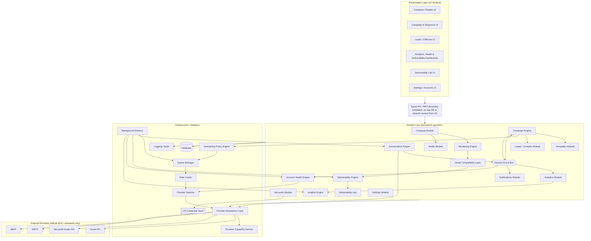

---

## 3. Module Breakdown

Each module owns exactly one responsibility and exposes a narrow interface. "Depends on" means "depends on the interface/port," never the concrete adapter. This table extends the original module set with the engines introduced by this revision; nothing below was removed, only clarified or split where a single module had grown more than one responsibility.

| Module | Responsibility | Depends on | Publishes events | Subscribes to |
|---|---|---|---|---|
| **Compose** | Turn user input into a validated draft object (rich text, attachments, inline images, personalization tokens, signature) | Templates, Rendering Engine | `DraftSaved`, `MessageSubmittedForSend` | — |
| **Drafts** | Persist and autosave in-progress draft objects, restore on crash/restart, materialize provider-side drafts where supported | Database, Provider Capability Service | `DraftSaved`, `DraftDiscarded`, `ProviderDraftCreated` | — |
| **Rendering Engine** | Maintain the Internal Document Model and serialize it into clean HTML and genuine plain text | (pure logic) | — | — |
| **Templates** | Store reusable bodies, subjects, and variants (weighting) | Database | `TemplateUpdated` | — |
| **Campaign Engine** | Own sequences, enrollments, step progression, stop conditions | Leads, Templates, Scheduling Policy Engine, Queue Manager | `EnrollmentAdvanced`, `SequenceCompleted`, `SequenceStopped` | `ReplyDetected`, `BounceDetected`, `UnsubscribeRequested` |
| **Leads / Contacts** | Store contact records, history, notes, labels, suppression status | Database | `LeadSuppressed`, `LeadImported` | `ReplyDetected`, `BounceDetected` |
| **Accounts** | Manage connected mailbox accounts, OAuth lifecycle, per-account sending limits/config | Credential Vault, Provider Layer | `AccountConnected`, `AccountDisconnected` | `AccountHealthDegraded` |
| **Provider Layer** | Abstract Gmail / Microsoft / SMTP / IMAP behind one `MailProvider` interface | External APIs | — | — |
| **Provider Capability Service** | Expose per-adapter capability descriptors (drafts, labels, threads, push, aliases, quotas) to the rest of the core | Provider Layer | `CapabilityChanged` | — |
| **Conversation Engine** | Subject normalization, Message-ID/reference graph reconstruction, participant matching, duplicate detection, thread merging, conversation state | Provider Layer, Database | `ReplyDetected`, `BounceDetected`, `NewMessageSynced`, `ConversationMerged` | — |
| **Gmail Compatibility Layer** | Answer "would Gmail generate this message?" against headers, MIME, and RFC compliance; produce a compatibility score and fixes | (pure logic) | `CompatibilityIssueFound` | — |
| **Deliverability Engine** | Evaluate a message/campaign/account against deliverability rules and explain findings | Gmail Compatibility Layer (for rfc/mime categories), Account Health Engine (for auth/reputation categories) | `DeliverabilityIssueFound` | — |
| **Deliverability Lab** | On-demand, side-effect-free diagnostic workbench reusing the same rule engines against hypothetical messages | Gmail Compatibility Layer, Deliverability Engine rule registry | — | — |
| **Account Health Engine** | Continuously assess whether a sending account itself is healthy; produce health score, risk warnings, recovery recommendations | Provider Layer, Conversation Engine (bounce/reply signals), DNS/auth checks | `AccountHealthDegraded`, `AccountHealthRecovered` | `ReplyDetected`, `BounceDetected`, `MessageSendFailed` |
| **Scheduling Policy Engine** | Orchestrate Business Hours, Timezone, Warm-up, Rate Limit, and Delay policies to compute a proposed send time and account | Settings, Account Health Engine, Campaign Engine | — | — |
| **Queue Manager** | Durable, ordered holding area for outbound messages; priority ordering | Database | `MessageQueued` | — |
| **Rate Limiter** | Authoritative, real-time admission control at dispatch time | Database | `RateLimitApplied` | — |
| **Provider Selector** | Resolve the concrete account/provider instance for a dispatch-ready message, informed by rotation strategy and Account Health | Account Health Engine, Provider Capability Service | — | — |
| **Analytics** | Record events, compute rollups, serve dashboard queries | Database | — | (almost) every domain event |
| **Insights Engine** | Turn rollups into causally-linked observations, trends, warnings, and anomaly flags | Analytics | `InsightGenerated` | — |
| **Background Workers** | Execute long-running/periodic jobs (sync, send, health checks, insight generation) | Queue Manager, Conversation Engine, Deliverability Engine, Account Health Engine | — | — |
| **Notifications** | Surface in-app alerts (reply arrived, campaign paused, account health issue) | — | — | most domain events |
| **Settings** | User preferences, sending defaults, signatures-by-account, business hours | Database | `SettingsChanged` | — |
| **Logging / Audit** | Structured logs, error capture, send audit trail | — | — | — |
| **Database** | Storage, migrations, transactions | — | — | — |

---

## 4. Folder Structure (High Level)

Logical structure, expressed by module boundary rather than by framework. This is what the hexagonal architecture looks like on disk, independent of the final language/framework choice:

```
outboundly/
├── core/                        # Pure domain logic — no I/O, fully unit-testable
│   ├── compose/
│   ├── drafts/
│   ├── rendering/                # Internal Document Model, HTML/plain-text renderers
│   ├── templates/
│   ├── campaigns/
│   ├── leads/
│   ├── accounts/
│   ├── conversation/              # Conversation Engine: header graph, dedupe, merge
│   ├── mime/                      # MIME generation + canonicalization
│   ├── gmail-compatibility/        # Gmail Compatibility Layer rule set
│   ├── deliverability/            # Deliverability Engine rule registry
│   ├── deliverability-lab/         # Sandbox orchestration reusing the above
│   ├── account-health/             # Account Health Engine rule set
│   ├── scheduling/
│   │   └── policies/                # BusinessHours, Timezone, Warmup, RateLimit, Delay
│   ├── analytics/
│   ├── insights/                    # Insight rule registry
│   └── shared-kernel/               # Value objects: EmailAddress, MimeMessage, ThreadId, etc.
│
├── ports/                        # Interfaces the core depends on
│   ├── mail-provider.port.ts
│   ├── provider-capabilities.port.ts
│   ├── repository.port.ts
│   ├── token-vault.port.ts
│   ├── clock.port.ts
│   ├── rate-limiter.port.ts
│   └── event-bus.port.ts
│
├── adapters/                     # Concrete implementations of ports
│   ├── providers/
│   │   ├── google/                  # includes its ProviderCapabilities descriptor
│   │   ├── microsoft/
│   │   ├── smtp/
│   │   └── imap/
│   ├── persistence/
│   │   ├── migrations/
│   │   └── repositories/
│   ├── credential-vault/
│   └── logging/
│
├── application/                   # Use-case orchestration (thin, calls into core + ports)
│   ├── send-message/
│   ├── enroll-lead/
│   ├── sync-inbox/
│   ├── run-deliverability-check/
│   └── run-lab-analysis/
│
├── workers/                        # Background job definitions
│   ├── send-worker/
│   ├── sync-worker/
│   ├── health-check-worker/
│   ├── insights-worker/
│   └── scheduler-tick/
│
├── ipc-boundary/                   # Typed, validated contract between UI and core
│
├── ui/                              # Presentation layer only
│   ├── compose/
│   ├── unified-inbox/
│   ├── campaigns/
│   ├── leads/
│   ├── dashboards/
│   ├── deliverability-lab/
│   └── settings/
│
├── test/                              # See Section 24
│   ├── unit/
│   ├── integration/
│   ├── provider-mocks/                # Fake Gmail / Fake Outlook / Fake SMTP
│   ├── mime-compatibility/            # Golden Gmail MIME fixtures + diffing
│   ├── load/
│   └── migration/
│
└── shared-config/                    # Non-secret app configuration (OAuth client IDs, redirect URIs)
```

The rule this structure encodes: **`core/` never imports `adapters/` or `ui/`.** Dependencies point inward. This is what "replaceable without affecting other modules" means concretely — swapping SQLite for another store only touches `adapters/persistence`, swapping Electron for another shell only touches `ui/` and `ipc-boundary/`, and adding a new deliverability check or a new insight rule only touches one file inside `core/deliverability/` or `core/insights/`.

---

## 5. Database Schema

Presented as a logical relational schema (engine-agnostic; the concrete engine is chosen in Section 27). This revision extends the original schema with tables needed by the Conversation Engine, Scheduling Policy Engine, Provider Capability Service, Account Health Engine, Deliverability Lab, and Insights Engine — the original messaging/leads/campaign core is retained unchanged except where noted.

### 5.1 Accounts & Identity

```
accounts
  id (pk), provider (google|microsoft|smtp_imap), email_address, display_name,
  status (connected|reauth_required|disconnected), connected_at, last_synced_at,
  daily_send_limit, hourly_send_limit, warmup_mode (bool), created_at, updated_at

oauth_tokens
  id (pk), account_id (fk -> accounts), provider_token_ref (opaque handle into OS vault),
  scope, expires_at, refresh_status, last_refreshed_at
  -- Actual token material NEVER stored in this table or any SQL table (see Section 23).

account_capability_overrides
  -- Runtime-discovered dynamic limits that differ from the adapter's static capability
  -- descriptor (Section 12.2), e.g. a quota value learned from a provider warning.
  id (pk), account_id (fk), capability_key, discovered_value, discovered_at, source
```

### 5.2 Account Health (replaces the earlier bare `account_health_snapshots` table — see Section 19)

```
account_health_snapshots
  id (pk), account_id (fk), captured_at,
  bounce_rate, reply_rate, spam_complaint_rate (if reported by provider),
  sends_last_24h, sends_last_7d,
  account_age_days, sending_consistency_score,
  spf_status (pass|fail|none), dkim_status (pass|fail|none), dmarc_status (pass|fail|none),
  oauth_failure_count_30d, token_expiring_soon (bool), provider_quota_usage_pct,
  health_score, risk_level (healthy|watch|at_risk|critical)

account_health_findings
  id (pk), snapshot_id (fk), finding_type, severity, message, explanation, recommended_action
```

### 5.3 Messaging Core

```
threads
  id (pk), account_id (fk), provider_thread_id, subject_normalized,
  conversation_state (active|awaiting_reply|stale|closed), created_at, updated_at

messages
  id (pk), thread_id (fk), account_id (fk), provider_message_id, message_id_header (RFC 5322),
  in_reply_to_header, references_header, direction (inbound|outbound),
  from_address, to_addresses (json), cc_addresses (json), bcc_addresses (json),
  subject, body_html, body_text, snippet, sent_at, received_at,
  status (draft|queued|sending|sent|failed|bounced), campaign_enrollment_id (fk, nullable),
  policy_trace_json (nullable),  -- which scheduling policies fired and why (Section 15)
  created_at, updated_at

attachments
  id (pk), message_id (fk), filename, mime_type, size_bytes, storage_ref, is_inline, content_id

drafts
  id (pk), account_id (fk), thread_id (fk, nullable), subject,
  document_model_json,   -- the Internal Document Model (Section 8), not raw HTML
  to_addresses (json), cc_addresses (json), bcc_addresses (json),
  provider_draft_ref (nullable),  -- set once a server-side draft exists (Section 7)
  autosave_version, last_saved_at
```

### 5.4 Conversation Engine (new — see Section 11 for why this is more than the `threads` table above)

```
message_reference_edges
  -- Normalized graph edges reconstructed from In-Reply-To / References headers,
  -- independent of any provider's native thread ID.
  id (pk), message_id (fk), referenced_message_id_header, position, created_at

conversation_participants
  id (pk), thread_id (fk), contact_id (fk, nullable), email_address, display_name,
  role (sender|to|cc), first_seen_at

thread_merges
  -- Records when two provider-distinct threads were proven (via header graph) to be
  -- the same conversation and merged into one canonical thread.
  id (pk), absorbed_thread_id (fk), canonical_thread_id (fk), reason, merged_at
```

### 5.5 Leads / Contacts

```
contacts
  id (pk), email (unique per user scope), first_name, last_name, company, title,
  timezone, custom_fields (json), source (csv_import|manual|reply), created_at, updated_at

contact_notes
  id (pk), contact_id (fk), body, created_at

suppression_list
  id (pk), email, reason (unsubscribed|bounced_hard|manual|complaint), created_at

labels / contact_labels
  labels: id (pk), name, color
  contact_labels: contact_id (fk), label_id (fk)
```

### 5.6 Templates & Campaigns

```
templates
  id (pk), name, document_model_json, created_at, updated_at

template_variants   -- template weighting / A-B/n testing
  id (pk), template_id (fk), variant_label, weight, document_model_override_json (nullable)

subject_variants
  id (pk), campaign_step_id (fk), subject_text, weight

sequences
  id (pk), name, description, status (draft|active|archived), created_at

sequence_steps
  id (pk), sequence_id (fk), step_order, delay_days, delay_hours,
  template_id (fk), stop_on_reply (bool), stop_on_bounce (bool), condition_json

campaigns
  id (pk), name, sequence_id (fk), sending_account_ids (json, supports rotation),
  business_hours_profile_id (fk), warmup_profile_id (fk, nullable), delay_policy_id (fk, nullable),
  status (draft|running|paused|completed),
  daily_limit_override, created_at

campaign_enrollments
  id (pk), campaign_id (fk), contact_id (fk), current_step_id (fk),
  status (active|stopped_reply|stopped_bounce|stopped_manual|stopped_suppressed|completed),
  next_send_at, enrolled_at, updated_at
```

### 5.7 Scheduling Policies (new — backs Section 15)

```
business_hours_profiles
  id (pk), name, timezone, windows_json (per-weekday start/end)

warmup_profiles
  id (pk), account_id (fk), start_date, ramp_schedule_json (day -> daily cap), current_daily_cap

delay_policy_configs
  id (pk), campaign_id (fk, nullable), min_delay_seconds, max_delay_seconds, jitter_strategy
```

### 5.8 Queue, Rate Limiting & Deliverability

```
send_queue
  id (pk), message_id (fk), account_id (fk), priority (manual|campaign),
  earliest_send_at, status (pending|claimed|sent|failed|cancelled),
  attempt_count, last_error, idempotency_key (unique), created_at

deliverability_reports
  id (pk), message_id (fk, nullable), campaign_id (fk, nullable), account_id (fk, nullable),
  scope (message|campaign|account), generated_at,
  overall_score, findings_json (array of {rule_id, category, severity, explanation})

lab_reports
  -- Deliverability Lab output (Section 18). Not tied to a real sent message —
  -- the input is a hypothetical draft/template, so this is intentionally a
  -- separate table from deliverability_reports rather than reusing it.
  id (pk), input_snapshot_json, score, findings_json, generated_at
```

### 5.9 Analytics & Insights

```
events
  id (pk), event_type (sent|delivered|bounced|replied|positive_reply|unsubscribed|opened|clicked|conversion),
  message_id (fk, nullable), campaign_id (fk, nullable), account_id (fk, nullable),
  occurred_at, metadata_json

campaign_metrics_rollup / template_metrics_rollup / subject_metrics_rollup / account_metrics_rollup
  -- materialized aggregates, recomputed by background worker, never the analytics source of truth

insights
  id (pk), scope (campaign|account|global), scope_id (nullable), insight_type,
  severity (info|warning|critical), message, explanation, recommended_action,
  generated_at, dismissed_at (nullable)
```

### 5.10 Indexing priorities

- `messages`: index on `(account_id, sent_at)`, `(thread_id)`, `(message_id_header)`, `(campaign_enrollment_id)`.
- `message_reference_edges`: index on `(referenced_message_id_header)` — this is the hot path the Conversation Engine's graph reconstruction depends on.
- `contacts`: unique index on `email`; index on labels via join table.
- `send_queue`: index on `(status, earliest_send_at)` — this is the hot path the Rate Limiter and dispatch workers poll.
- `campaign_enrollments`: index on `(status, next_send_at)` — the hot path the Scheduling Policy Engine polls.
- `events`: index on `(campaign_id, event_type, occurred_at)` and `(account_id, event_type, occurred_at)` for rollup and Insights Engine computation.
- `account_health_snapshots`: index on `(account_id, captured_at)` for trend queries.

---

## 6. Compose Architecture

Gmail-grade composing, decomposed. This section covers the user-facing compose experience; Section 7 covers how a compose action becomes a durable draft object and Section 8 covers how that draft is rendered into HTML/text.

- **Editor surface**: rich-text editing that writes into the **Internal Document Model** (Section 8) rather than producing an HTML string directly — this is what makes clean output structurally guaranteed rather than a matter of editor discipline.
- **Personalization tokens**: `{{first_name}}`, `{{company}}`, custom fields — resolved at *send time*, not at compose time, so a template remains reusable. Token resolution is a pipeline stage (Section 9), not something the editor does inline, so campaigns and one-off compose share the exact same resolver and the exact same "missing token" validation.
- **Signatures**: per-account, stored as structured content in the same Internal Document Model shape (not baked HTML the user can't edit consistently), inserted as a compose-time default the user can still edit per-message.
- **Attachments & inline images**: attachments stored via content-addressed local storage reference; inline images become `cid:` references in HTML with matching MIME parts — never remote-hosted `` tags for content the user attached (remote-hosted images the user *chooses* to link are a separate, explicit action, and the Deliverability Engine flags an excessive image/text ratio either way).
- **Draft autosave**: every N seconds and on every significant edit, writes to the `drafts` table with an incrementing `autosave_version`; on crash, the UI reopens the latest autosave rather than losing content. This is the same durability guarantee as Gmail's compose box, achieved locally instead of via a server round-trip, and is the first stage of the Draft Lifecycle described in Section 7.
- **Reply / Reply All / Forward**: constructed from the existing thread's headers, resolved through the Conversation Engine (Section 11) so `In-Reply-To` / `References` are correct from the moment of composition, not patched on later.
- **Undo Send**: implemented honestly — a compose action places the message into the `send_queue` with `earliest_send_at = now + N seconds` (user-configurable, default ~10s). "Undo" simply cancels the queued row before the Rate Limiter claims it (Section 16). This is the same mechanism Gmail itself uses; there is no real "recall after transmission," and the UI should not imply one.
- **Keyboard shortcuts & minimal-click workflow**: a UI-layer concern, but the compose module's command surface (send, save-draft, discard, attach, insert-template) must be exposed as discrete callable intents so shortcuts and buttons invoke the same code path — no shortcut-only logic.

---

## 7. Gmail-Style Draft Lifecycle

### 7.1 Why the previous "compose → generate MIME → send" model is wrong for this product

A pipeline that treats sending as "build the message, then transmit it" collapses two very different concerns into one step: *authoring* (which should be editable, undoable, resumable, and inspectable) and *transmission* (which should be atomic, rate-limited, and irreversible once past the undo window). Gmail itself never actually sends a message directly from the compose box — internally, every send is "finalize the draft, then send the draft." Outboundly adopts the same discipline deliberately, for both manually composed and campaign-generated mail.

### 7.2 The lifecycle

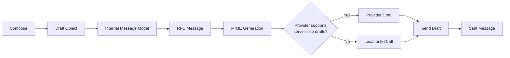

- **Compose** → raw editor state, backed by the Internal Document Model (Section 8).
- **Draft Object** → persisted, autosaved, versioned row in `drafts`. This exists for every message — a manually typed reply and a campaign step both become a `drafts` row before anything else happens. For campaign steps this draft is created programmatically at the moment personalization resolves, but it is still a real, inspectable draft, not an ephemeral in-memory object — a user can open "Campaign X → Contact Y → Step 2" and see exactly the draft that is about to go out, the same way they could inspect a Gmail draft.
- **Internal Message Model** → the resolved, personalized content plus recipients/headers-in-progress, still provider-agnostic.
- **RFC Message** → RFC 5322 header assembly (Section 9.2).
- **MIME Generation** → multipart structure assembly (Section 9.3), followed immediately by MIME Canonicalization (Section 9.4).
- **Provider Draft (when supported)** → the Provider Capability Service (Section 12.2) is consulted: if the target account's provider supports server-side drafts (Gmail API, Microsoft Graph both do), Outboundly materializes the finalized MIME as an actual provider-side draft via `MailProvider.createDraft()` before sending it. If the provider has no draft concept (raw SMTP), this stage is a no-op and the local `drafts` row remains the only draft representation.
- **Send Draft** → for providers with server-side drafts, this calls the provider's "send this draft" operation rather than a bare "send this MIME blob" call, so the message Gmail's or Microsoft's own infrastructure transmits is *literally* the draft it already has on file — reinforcing the Guiding Philosophy at the transport level, not just at the formatting level. For SMTP, "Send Draft" is the standards-based SMTP submission of the finalized MIME.
- **Sent Message** → reconciled into local storage exactly as before (Section 9.5).

### 7.3 Benefits this unlocks

- **Autosave** and **crash recovery** apply uniformly, including to in-flight campaign sends — if the app crashes between "Draft Object created" and "Send Draft," nothing is lost and nothing double-sends, because the queue/rate-limiter layer (Section 16) resumes from the same durable draft row.
- **Editing before sending** — a queued campaign email sitting in its undo/eligibility window is a real, editable draft, not a frozen buffer, so a user can intervene on an individual send without pulling the whole campaign out of the pipeline.
- **Consistent compose experience** — the UI's "open this message" view is the same code path whether the message is a personal draft-in-progress or a campaign step waiting to fire.
- **Undo capability** — Undo Send (Section 6) is just "delete/cancel this draft's queue row before Send Draft fires," which is only a clean operation because a draft object exists to cancel in the first place.
- **Easier debugging** — every send has a persisted, inspectable Draft Object → RFC Message → MIME artifact trail, so a support/debugging session can see exactly what was about to be transmitted at each stage rather than reconstructing it after the fact.
- **Better provider compatibility** — using the provider's own draft-then-send API surface (where available) means Outboundly's sent mail passes through the exact code path Gmail/Outlook expect a well-behaved client to use, rather than a raw injection-style send call.

---

## 8. Email Rendering Engine

### 8.1 Never let raw HTML reach the sending pipeline

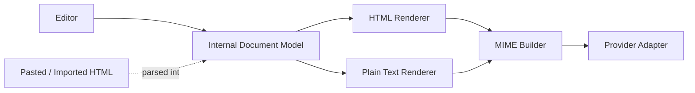

The **Internal Document Model (IDM)** is a structured, constrained representation of message content — paragraphs, formatted text runs, links, images, quote blocks, and personalization tokens as typed nodes — never a raw string of HTML. It is the single source of truth for a message's content, independent of which editor produced it or whether the content originated from a stored template.

- Content typed directly into the compose editor is built into the IDM as the user types (Section 6).
- Pasted or imported HTML (e.g., a template authored elsewhere) is **parsed into** the IDM — unsupported constructs are normalized or dropped at that boundary — before it can flow anywhere else in the pipeline. Raw HTML never has a path directly to the MIME Builder.

### 8.2 Why this improves consistency

Because the HTML Renderer and Plain Text Renderer both serialize from the *same* IDM, the HTML and plain-text parts of a message are guaranteed to represent the same content — they can only diverge in presentation, never in substance. This eliminates a whole class of naive-implementation bugs where the plain-text part is a stub, out of date, or produced by crudely stripping tags out of HTML (which reliably produces garbled whitespace, leftover style-related junk, and broken lists).

### 8.3 Why this prevents malformed emails

The HTML Renderer is a controlled serializer over a known, closed node schema — it is structurally impossible for it to emit an unclosed tag, a disallowed element, or leftover editor cruft, because it never passes arbitrary content through; it only ever emits from nodes it knows how to render. This is a stronger guarantee than "clean up the HTML afterward," because there is no "before" state where malformed HTML exists in the pipeline at all — cleanup happens once, at the parse-into-IDM boundary, rather than as a best-effort late-stage patch.

### 8.4 How Gmail-like rendering is achieved

The HTML Renderer's output rules are modeled directly on the patterns Gmail's own compose surface produces, per the Guiding Philosophy: minimal, targeted inline styles rather than a style attribute duplicated onto every element; a constrained, well-supported tag set; consistent, recognizable quote-block markup for replies (`<blockquote>`-based, attributed to the original sender/date the way Gmail formats it); consistent signature markup. This is *not* reverse-engineering private Gmail internals — the target is the well-documented, standards-compliant shape of output that Gmail happens to already produce, verified independently against RFC 5322/MIME rather than against Gmail's undocumented behavior (see Section 10).

---

## 9. Message Generation & MIME Pipeline

This is the spine of the product. Every outbound message — whether typed by hand or generated by a campaign step — passes through the identical pipeline, now extended to include the Draft Lifecycle (Section 7), the Rendering Engine (Section 8), MIME Canonicalization, and the Gmail Compatibility Layer (Section 10). That uniformity is intentional: a campaign email should be exactly as standards-compliant as a manually composed one.

### 9.1 Full pipeline

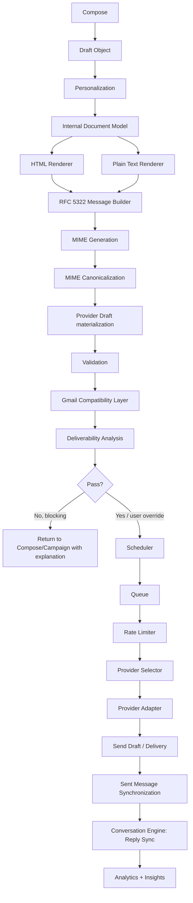

### 9.2 Stage contracts

Each stage has one input type, one output type, and is independently testable (Section 24):

1. **Compose** → raw editor state (rich content + attachments + recipient list + template reference), backed by the IDM.
2. **Draft Object** → persisted, versioned Draft Lifecycle entry (Section 7). Idempotent save.
3. **Personalization** → resolves tokens against the recipient's contact record; produces a *fully resolved* content object. Missing/unresolvable tokens are a hard stop here, not discovered later — this prevents "Hi {{first_name}}," from ever reaching a send attempt.
4. **Internal Document Model** → the resolved content normalized into the Rendering Engine's structured representation (Section 8).
5. **HTML Renderer** → serializes the IDM into clean, constrained HTML.
6. **Plain Text Renderer** → serializes the *same* IDM into a genuine plain-text alternative — not a derived-by-stripping-tags stub — so the `multipart/alternative` part is meaningful, both a real deliverability factor and correct MIME practice.
7. **RFC 5322 Message Builder** → assembles required headers: `From`, `To`, `Subject`, `Date`, `Message-ID`, `MIME-Version`, correct `In-Reply-To`/`References` (sourced from the Conversation Engine, Section 11, for threaded messages), `Reply-To` if configured. Message-ID generation follows the RFC 5322 recommended form (unique-string @ sending-domain) and is stable/deterministic per message so retries don't mint duplicate IDs.
8. **MIME Generation** → builds the *structurally* correct multipart tree: `multipart/mixed` (attachments) wrapping `multipart/alternative` (text/plain + text/html) wrapping `multipart/related` (inline images), only including the layers actually needed for a given message. This stage is concerned purely with the shape of the tree.
9. **MIME Canonicalization** (Section 9.4) → normalizes the *wire format* of that tree: header ordering, header folding, CRLF normalization, charset normalization, quoted-printable optimization, transfer encoding selection, boundary generation, duplicate header removal, whitespace normalization.
10. **Provider Draft materialization** → per the Draft Lifecycle (Section 7.2), the finalized MIME is registered as a server-side draft where the Provider Capability Service (Section 12.2) says the account's provider supports it.
11. **Validation** → structural correctness re-check post-canonicalization: well-formed MIME, no duplicate headers, valid header folding/line lengths, correct encoding declarations, valid `Content-Transfer-Encoding` per part.
12. **Gmail Compatibility Layer** (Section 10) → mechanical "would Gmail generate this?" scoring across headers, MIME, and RFC compliance; its findings populate the `rfc`/`mime` categories consumed by the next stage.
13. **Deliverability Analysis** (Section 17) → the Deliverability Engine runs its full rule set — including the Gmail Compatibility Layer's findings as one input — and returns a scored report with explanations. Findings are categorized as **blocking** (must fix before send) or **advisory** (shown, overridable).
14. **Scheduler** (Section 15) → the Scheduling Policy Engine proposes an eligible send time and a candidate sending account.
15. **Queue** (Section 16) → the proposal is persisted as a durable, ordered `send_queue` row.
16. **Rate Limiter** (Section 16.2) → authoritative, real-time admission check at the moment of dispatch.
17. **Provider Selector** (Section 16.3) → resolves the final concrete account/provider instance, re-validating the Scheduler's proposal against current Account Health and capacity.
18. **Provider Adapter** → the technical transport implementation for the resolved provider.
19. **Send Draft / Delivery** → the actual transmission, using the provider's send-draft operation where a provider draft exists.
20. **Sent Message Synchronization** → the sent message is reconciled into the local `messages`/`threads` tables (some providers auto-file to Sent; SMTP-only accounts require an explicit append to the Sent folder via IMAP).
21. **Conversation Engine: Reply Sync** (Section 11) → threads reply back to the originating message via the header graph, not the old flat "Inbox Synchronization" model.
22. **Analytics + Insights** (Section 20) → every stage transition and terminal outcome emits a domain event that Analytics records and the Insights Engine eventually interprets.

Because campaign-generated messages and manually composed messages both enter at "Draft Object" with the same shape of input, the Campaign Engine's only real job is: pick the next contact, pick the next template/subject variant, and hand a resolved intent to this same pipeline. No parallel send path exists anywhere in the system.

### 9.3 MIME Generation vs. 9.4 MIME Canonicalization — why they are separate stages

It would be simpler to merge "build the MIME tree" and "make the MIME tree wire-correct" into one step. They are deliberately kept separate:

- **MIME Generation** is concerned with *structure*: does the multipart tree match the content (attachments present, alternative parts present, inline images correctly referenced)? This can be tested purely against the tree shape, independent of any formatting concern.
- **MIME Canonicalization** is concerned with *wire-format normalization*, independent of structure: header ordering, header folding (RFC 5322 line-length limits), CRLF normalization (never bare LF), charset normalization (UTF-8 throughout, correctly declared), quoted-printable vs. base64 selection per part, boundary generation (cryptographically random, collision-free), duplicate header removal, whitespace normalization.

Separating them means each can be unit-tested against a narrow contract, and — critically for this product's philosophy — **MIME Canonicalization is the one seam that can be diffed directly against real Gmail-generated MIME** in the MIME Compatibility Testing suite (Section 24.7): given a structurally-equivalent message, does canonicalization produce the same *class* of wire format a compliant, Gmail-like client would produce? That test would be far harder to write meaningfully against a single fused "generate MIME" stage, because structural differences and formatting differences would be tangled together in the diff.

### 9.5 Sent Mail Synchronization

Unchanged in intent from the original design: some providers auto-file sent mail (Gmail, Graph); SMTP-only accounts require an explicit `appendToSentFolder` call via the paired IMAP adapter (Section 12).

---

## 10. Gmail Compatibility Layer

### 10.1 Purpose

A dedicated subsystem whose only question is: **"Would Gmail generate this message?"** This is deliberately narrower and more mechanical than the Deliverability Engine (Section 17) — it is a conformance checker, not a sending-behavior or content-quality evaluator. It exists because "clean MIME generation... over shortcuts" (Guiding Philosophy) deserves a dedicated, reusable, independently testable subsystem rather than being one diffuse concern spread across the MIME Generation and Validation stages.

### 10.2 What it validates

| Category | Checks |
|---|---|
| **Headers** | `Message-ID` well-formed and unique, `References`/`In-Reply-To` correctly populated for replies, `Date` present and correctly formatted, `From` present and consistent with the authenticated account, `Reply-To` sensible if present, required MIME headers (`MIME-Version`, `Content-Type`) present |
| **MIME** | Correct multipart structure for the content present, valid boundary formatting, correct `Content-Transfer-Encoding` per part, correct charset declaration, CRLF line endings |
| **RFC compliance** | RFC 5322 (message format), RFC 2045 (MIME message bodies), RFC 2046 (MIME media types) |

### 10.3 Output

- **Compatibility score** — a single normalized score summarizing conformance.
- **Detected issues** — one entry per failed check, each carrying its own explanation (consistent with the cross-cutting "explain, don't just flag" rule from the Guiding Philosophy).
- **Recommended fixes** — a concrete, actionable remediation per issue (e.g., "References header is missing the immediate parent Message-ID — this breaks threading in the recipient's client").

### 10.4 Relationship to the Deliverability Engine

The Gmail Compatibility Layer is **not** a second, competing rules engine sitting alongside the Deliverability Engine's own `rfc`/`mime` rule categories (Section 17.2) — that would be redundant and would risk the two disagreeing. Instead, the Deliverability Engine's `rfc` and `mime` category rules **delegate their evaluation to the Gmail Compatibility Layer**. The Compatibility Layer is built as its own subsystem — with its own scoring and its own test suite — because it is reused in three places: inline in the main pipeline (Section 9.2, stage 12), inside the Deliverability Lab's sandbox analysis (Section 18), and as the subject-under-test in the MIME Compatibility Testing regression suite (Section 24.7). One implementation, three consumers, no duplicated logic.

---

## 11. Conversation Engine

### 11.1 Why a simple `threads` table is not enough

A `threads` table keyed by provider thread ID is passive storage — it records *that* a grouping exists, but does nothing to determine *what belongs in it* or to keep that grouping correct across sync races, multiple accounts, and providers that don't share a thread-ID concept at all (SMTP/IMAP has none). The Conversation Engine is the active logic layer that owns those decisions; `threads`, `messages`, `message_reference_edges`, and `conversation_participants` (Section 5.4) are simply the storage it manages.

### 11.2 Responsibilities

```mermaid
flowchart TB
    Inbound[Inbound / synced message] --> Norm[Subject Normalization\n(strip Re:/Fwd:/list tags, whitespace)]
    Norm --> IDTrack[Message-ID Tracking\n(canonical registry across all accounts)]
    IDTrack --> Graph[Reference Graph Reconstruction\n(In-Reply-To / References -> DAG, not a flat thread_id)]
    Graph --> Participants[Participant Matching\n(dedupe contacts across display names/aliases)]
    Participants --> Dup{Duplicate of an\nalready-synced message?}
    Dup -- Yes --> Discard[Discard / mark duplicate]
    Dup -- No --> Merge{Header graph proves\nsame conversation as an\nexisting, provider-distinct thread?}
    Merge -- Yes --> DoMerge[Thread Merge]
    Merge -- No --> Attach[Attach to existing or new thread]
    DoMerge --> State[Conversation State Update]
    Attach --> State
    State --> Events[Emit ReplyDetected / NewMessageSynced / ConversationMerged]
```

- **Subject normalization**: strips `Re:`/`Fwd:`/`Fw:` prefixes, mailing-list decorations, and whitespace variance so subject-based signals are usable as a *corroborating*, not authoritative, signal.
- **Message-ID tracking**: a canonical registry mapping every known `Message-ID` header to its internal message row, spanning *all* connected accounts — necessary because a reply might arrive in a different connected account than the one that sent the original message (e.g., BCC'd to a secondary account).
- **In-Reply-To / References graph reconstruction**: unlike a flat `thread_id`, the Conversation Engine builds an actual reference graph (a message can reference multiple ancestors), which is what makes correct reply attribution possible even across forwards and partial quote chains.
- **Participant matching**: reconciles the same real contact appearing under different display names or address casing within one conversation.
- **Duplicate detection**: a message can be synced twice (e.g., delivered via both a push notification and a subsequent poll, or CC'd to a second monitored account) — detected and collapsed via `Message-ID` before it ever produces a duplicate `ReplyDetected` event.
- **Thread merging**: when two provider-native thread IDs turn out to be the same conversation — most commonly, a reply arriving on an SMTP/IMAP-only account that has no native thread ID at all — the header graph is the authoritative signal that triggers a merge, recorded in `thread_merges` for auditability.
- **Conversation state**: `active` / `awaiting_reply` / `stale` / `closed`, used by Notifications and by the Campaign Engine's stop-condition logic (Section 14.3) and surfaced in the unified inbox.

### 11.3 Provider thread IDs as a fast path, headers as the source of truth

Where a provider's own thread ID is available (Gmail, Graph), it is used as a quick corroborating signal to avoid unnecessary graph recomputation. But the header graph — `Message-ID`/`In-Reply-To`/`References` — remains authoritative, because it is the only mechanism that works uniformly across every provider, including SMTP/IMAP accounts that have no thread concept at all.

---

## 12. Provider Abstraction & Capability Detection

### 12.1 The contract

```
interface MailProvider {
  authenticate(account: AccountRef): Promise<void>
  sendMessage(message: BuiltMimeMessage): Promise<ProviderSendResult>
  createDraft(message: BuiltMimeMessage): Promise<ProviderDraftRef>
  sendDraft(draftRef: ProviderDraftRef): Promise<ProviderSendResult>
  listChangesSince(account: AccountRef, cursor: SyncCursor): Promise<ChangeSet>
  fetchThread(account: AccountRef, threadRef: string): Promise<NormalizedThread>
  appendToSentFolder(account: AccountRef, rawMessage: Buffer): Promise<void>  // needed for SMTP/IMAP-only accounts
  capabilities(): ProviderCapabilities
  registerWatch?(account: AccountRef): Promise<WatchHandle>   // Gmail watch / Graph subscription, where available
}
```

The **compose, campaign, deliverability, and queue modules only ever see this interface** and a `NormalizedMessage` / `NormalizedThread` domain model — never a raw Gmail API payload or a raw Graph payload. All provider-specific field mapping happens inside the adapter.

### 12.2 Provider Capability Matrix

Each adapter exposes a static capability descriptor through the `Provider Capability Service`, so the rest of the core can make decisions (whether to materialize a server-side draft, Section 7.2; whether to show label-based UI; whether to expect a native thread ID, Section 11.3) without hardcoding per-provider `if` statements throughout the codebase:

```
interface ProviderCapabilities {
  supportsDrafts: boolean
  supportsLabels: boolean
  supportsNativeThreads: boolean
  supportsIncrementalSyncCursor: boolean   // History API / delta query equivalent
  supportsPushNotifications: boolean
  supportsAliases: boolean
  supportsSendAs: boolean
  maxAttachmentSizeBytes: number
  maxRecipientsPerMessage: number
}
```

| Provider | Drafts | Labels | Native threads | Incremental sync cursor | Push | Aliases / Send-as |
|---|---|---|---|---|---|---|
| **Gmail API** | Yes | Yes | Yes | Yes (History API) | Yes (Cloud Pub/Sub watch) | Yes |
| **Microsoft Graph** | Yes | Categories (partial analog) | Yes (`conversationId`) | Yes (delta query) | Yes (change notifications/webhooks) | Yes, subject to tenant configuration |
| **SMTP / IMAP** | No (local-only draft) | No (IMAP folders/flags as a partial analog) | No — Conversation Engine header-graph reconstruction is load-bearing here | No (UID-based polling only) | Limited (IMAP `IDLE` only) | Entirely server-configuration-dependent, not queryable |

Runtime-discovered values that diverge from these static descriptors (e.g., an actual quota ceiling learned from a provider warning) are recorded in `account_capability_overrides` (Section 5.1) rather than mutating the static descriptor, keeping "what the provider generally supports" and "what we've observed for this specific account" cleanly separate.

### 12.3 Adapters

| Adapter | Transport | Sync mechanism | Notes |
|---|---|---|---|
| **Google** | Gmail API (`users.messages.send`, `.drafts`, `.threads`, `.history`) | History API (incremental) + optional push via Cloud Pub/Sub watch | Preferred over raw SMTP/IMAP for Google accounts — richer thread/label semantics, better rate-limit transparency, native draft support |
| **Microsoft** | Microsoft Graph API (`/me/sendMail`, `/me/messages`, `/me/mailFolders/drafts`, delta queries) | Delta query (`/messages/delta`) + optional Graph change notifications (webhooks) | Preferred over raw SMTP/IMAP for Microsoft 365/Outlook accounts |
| **SMTP** | Standards-based SMTP submission (587/STARTTLS or 465/implicit TLS) | N/A (send-only) | For any provider without a first-class API; always paired with an IMAP adapter for the same account; no server-side draft concept |
| **IMAP** | Standards-based IMAP (IDLE where supported, else poll) | UID-based incremental sync | Read/sync counterpart to the SMTP adapter |

### 12.4 Why not a single "just use SMTP/IMAP for everything" approach

It would be simpler to implement one adapter and point it at every provider. It is deliberately rejected: Gmail and Microsoft 365 both expose OAuth-scoped, rate-limit-transparent, thread-aware, draft-aware official APIs that produce a measurably better sync/send experience than SMTP/IMAP can. SMTP/IMAP remains as the universal fallback for every other provider, which is exactly the role it should play.

---

## 13. OAuth Architecture

### 13.1 Design goal restated

The user clicks "Sign in with Google" or "Sign in with Microsoft" and authorizes access. They never see a Client ID, a Client Secret, or a redirect URI configuration screen. Outboundly (the application/vendor) owns one registered OAuth application per provider (one Google Cloud project, one Azure AD app registration), shared by every installation of the app.

### 13.2 Flow (both providers)

- **Authorization Code flow with PKCE (RFC 7636)**, which is the correct, current best practice for installed/native/desktop applications from both Google and Microsoft — it removes the need for a true confidential-client secret at all, because the security boundary is the PKCE code verifier, not a stored secret.
- **Loopback redirect** (`http://127.0.0.1:{ephemeral-port}/callback`), per Google's and Microsoft's own guidance for installed apps — a short-lived local HTTP listener receives the redirect, extracts the code, and immediately shuts down.
- Scopes requested are the minimum necessary for the account's declared purpose (send + sync), requested incrementally where the provider supports it, never a broad "full account access" scope out of convenience.

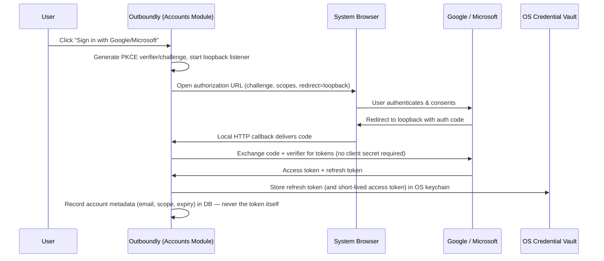

### 13.3 Token lifecycle

- **Storage**: refresh tokens (and, if desired, cached access tokens) live only in the OS-native credential store (Keychain / Credential Manager / Secret Service). The SQL database stores only an opaque reference and metadata (Section 23).
- **Refresh**: a background worker refreshes access tokens proactively before expiry; on refresh failure (revoked consent, expired refresh token), the account transitions to `reauth_required` and Notifications surfaces a one-click "Reconnect" action that repeats the flow above. The Account Health Engine (Section 19) tracks `oauth_failure_count_30d` and `token_expiring_soon` as first-class technical-health signals.
- **Disconnect**: revokes the token with the provider (where supported) and purges vault + metadata.

### 13.4 On the "embedded secret" question

If a future provider integration insists on a confidential-client credential that cannot use PKCE-only public-client flow, the correct pattern is **not** to embed a real secret in a distributable desktop binary. The correct pattern is a minimal, stateless token-exchange relay: a tiny backend endpoint that holds the real secret, accepts only `(auth code, PKCE verifier)`, and returns tokens — it sees no user data and stores nothing. Google and Microsoft's own current desktop flows do not require this today; it's documented here as the fallback if a future provider does.

---

## 14. Campaign Engine Architecture

### 14.1 Core entities

- **Sequence**: an ordered list of **steps**, each with a template, a delay from the previous step, and stop conditions.
- **Campaign**: a running instance of a sequence bound to a set of contacts, a set of sending accounts (for rotation), a business-hours profile, and optional warm-up/delay policy overrides.
- **Enrollment**: one contact's progress through one campaign — the actual state machine.

### 14.2 Enrollment state machine

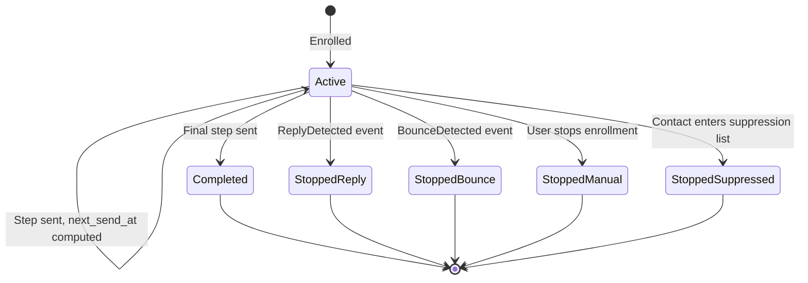

### 14.3 How a step actually fires

1. A background worker periodically queries `campaign_enrollments` where `status = active AND next_send_at <= now`.
2. For each due enrollment, the Campaign Engine selects the step's template (and, if weighted variants exist, picks a variant per the configured weighting), resolves the contact, and hands a fully-specified send intent to the Message Generation Pipeline (Section 9) starting at Personalization — which, per Section 7, immediately becomes a real Draft Object.
3. On successful queuing, `next_send_at` advances to `now + step[n+1].delay`, itself re-evaluated by the Scheduling Policy Engine (Section 15) rather than a raw addition; on the final step, the enrollment completes.
4. Stop conditions are **not polled** — they are event-driven. The Campaign Engine subscribes to `ReplyDetected`/`BounceDetected`/`UnsubscribeRequested` (the first two now emitted by the Conversation Engine, Section 11) and immediately transitions any matching active enrollment to a stopped state, rather than waiting for its next scheduled tick.

### 14.4 Account rotation

A campaign may be bound to more than one sending account. Rotation is owned by the **Provider Selector** (Section 16.3), informed by the Account Health Engine's (Section 19) health score, not hardcoded inside the Campaign Engine — round-robin, least-recently-used, and weighted-by-health-score are all expressible as pluggable rotation strategies against the same `campaign.sending_account_ids` list.

---

## 15. Policy-Based Scheduling & Smart Scheduler Engine

### 15.1 The Scheduler's narrowed responsibility

The Scheduler answers exactly three questions and delegates everything else:

- **When** should this email be sent?
- **Which account** should send it?
- **What policy rules** apply?

It does **not** contain business rules itself. Business rules live in independent, individually testable **policy objects**; the Scheduler's only job is to orchestrate them in a defined order and produce a single proposed outcome.

```
interface SchedulingPolicy {
  id: string
  apply(candidate: SchedulingCandidate, ctx: SchedulingContext): SchedulingCandidate
}

interface SchedulingCandidate {
  proposedSendAt: DateTime
  candidateAccountId: AccountId
  rejectedAccountIds: AccountId[]
  trace: PolicyTraceEntry[]   // persisted to send_queue.policy_trace_json / messages.policy_trace_json
}
```

### 15.2 The five policies

| Policy | Controls |
|---|---|
| **Business Hours Policy** | Allowed sending windows, working days, weekend restrictions |
| **Timezone Policy** | Recipient timezone handling, sender timezone, local-time-of-day optimization |
| **Warm-up Policy** | New-account sending limits, gradual volume ramp, account-age-aware caps |
| **Rate Limit Policy** | Provider limits, account limits, campaign limits — evaluated *predictively*, ahead of actual dispatch |
| **Delay Policy** | Follow-up delays, randomized spacing, human-like timing between sends |

### 15.3 Orchestration order

```mermaid
flowchart LR
    Start[Raw candidate: step delay elapsed] --> P1[Warm-up + Rate Limit Policy\n(account eligibility filter)]
    P1 -- Account ineligible --> Rotate[Try next account in rotation]
    Rotate --> P1
    P1 -- Account eligible --> P2[Timezone Policy\n(localize candidate window)]
    P2 --> P3[Business Hours Policy\n(snap to allowed window)]
    P3 --> P4[Delay Policy\n(jitter / natural spacing)]
    P4 --> Final[Final SchedulingCandidate\n-> handed to Queue]
```

Order matters: **Warm-up** and **Rate Limit** policies determine *account eligibility* first (there is no point localizing a send time for an account that's about to be rejected), then **Timezone** and **Business Hours** determine *timing*, and **Delay** applies last so its jitter is never subsequently clipped back into a business-hours boundary by an earlier policy.

### 15.4 Why there are two rate-limit checks (Policy vs. Rate Limiter)

The **Rate Limit Policy** here is *predictive and soft*: when the Scheduler proposes a time — which may be hours or days ahead of actual dispatch — it uses the best information available *right now* to avoid proposing an account/time combination that's already known to be over cap. The **Rate Limiter** pipeline component (Section 16.2) is *authoritative and hard*: it re-checks against real-time counts at the actual moment of dispatch, which is necessary because conditions can change in the interim — a manual send the user fires off between proposal and dispatch, another campaign step landing on the same account, or an account health change. This is a deliberate "propose early, confirm late" pattern, not redundant logic: the Policy avoids obviously bad proposals cheaply and early; the Rate Limiter is the single source of truth that can never be bypassed no matter how stale a proposal has become.

The same "propose early, confirm late" relationship exists for account selection: the Scheduler's Warm-up/Rate-Limit-filtered `candidateAccountId` is a *proposal*, and the **Provider Selector** (Section 16.3) re-validates and, if necessary, substitutes a different eligible account at actual dispatch time.

### 15.5 Smart Scheduler Engine — pacing intelligence

"Smart Scheduler Engine" is not a sixth, competing component — it is the name for the Scheduler operating with its full policy set engaged, plus the pacing behaviors that emerge from how those policies are configured and informed by live data:

- **Avoid weekends** and **avoid bad sending hours** — Business Hours Policy, optionally informed by historical reply-rate-by-hour data from the Insights Engine (Section 20.4) rather than a static window alone.
- **Spread emails across accounts** and **avoid simultaneous sending** — Provider Selector rotation (Section 16.3), weighted by Account Health (Section 19), combined with Delay Policy jitter so multiple accounts don't fire in the same instant.
- **Per-account pacing** and **per-provider pacing** — Warm-up Policy and Rate Limit Policy, scoped per account and, where a provider-wide ceiling exists independent of any one account, per provider.
- **Randomized delays** and **natural sending patterns** — Delay Policy deliberately introduces jitter rather than perfectly even spacing; identical, machine-precise intervals between sends are themselves a fingerprint that a sophisticated filter can key on, so natural variance is a legitimate, standards-compliant deliverability measure — not a spam trick, since nothing about the message content or headers is being altered to deceive anything.

### 15.6 Policy explainability

Every policy's decision is appended to the `SchedulingCandidate.trace`, persisted as `policy_trace_json` on the resulting `send_queue`/`messages` row (Section 5.3, 5.8). This means "why was this email sent at 9:14am from Account B instead of 8:00am from Account A?" is always answerable from stored data — consistent with the cross-cutting explainability rule.

---

## 16. Queue, Rate Limiter & Delivery Pipeline

### 16.1 Redesigned delivery pipeline

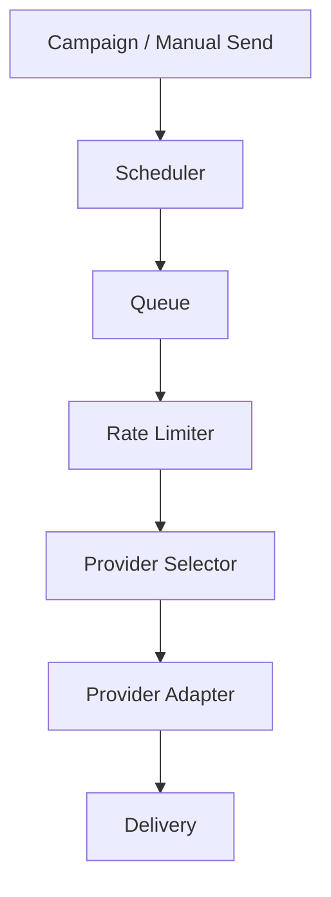

Each component now has one narrow job, replacing the earlier design where the Queue Manager alone was responsible for both durable ordering *and* rate-limit enforcement *and* rotation:

- **Scheduler** (Section 15): decides when and on which candidate account, via policy orchestration. Produces a proposal, not a guarantee.
- **Queue**: durable, ordered holding area. Nothing more — pure storage and priority ordering.
- **Rate Limiter**: authoritative admission control at the moment of dispatch.
- **Provider Selector**: resolves the final concrete account/provider instance.
- **Provider Adapter**: technical transport.
- **Delivery**: transmission and confirmation handling.

### 16.2 Queue and Rate Limiter

**Queue** — There is exactly one outbound queue (`send_queue`). A manually composed message and a campaign step both terminate in a row in this table.

- **Priority**: manual/user-initiated sends are `priority=manual` and are considered before `priority=campaign` rows when both are eligible in the same account window.
- **Durability**: the queue is the SQL table itself, not an in-memory structure — an app restart or crash loses zero pending sends.

**Rate Limiter** — a distinct, authoritative component consulted immediately before a claimed queue row is actually dispatched:

```
interface RateLimiter {
  checkAndReserve(accountId: AccountId, providerId: ProviderId, campaignId?: CampaignId): RateLimitDecision
}

type RateLimitDecision =
  | { allowed: true }
  | { allowed: false; retryAfter: DateTime; reason: string }
```

It counts recent `sent` rows in the relevant rolling windows (hourly/daily, per account and, where applicable, per provider-wide ceiling) and either reserves the slot atomically or denies it with an explained `retryAfter`. Separating this from the Queue's storage/ordering responsibility means each can be tested and reasoned about independently: the Queue's correctness is about never losing or misordering work; the Rate Limiter's correctness is about never letting an account exceed its ceiling, even under concurrent claims from multiple workers.

### 16.3 Provider Selector

Resolves *which specific account* (and therefore which provider adapter instance) actually handles a rate-limiter-approved message, for campaigns bound to multiple sending accounts. Consults:

- The Scheduler's proposed `candidateAccountId` (Section 15.4) as a starting point.
- The Account Health Engine's (Section 19) current health score, to prefer healthier accounts and avoid a degraded one even if it was the original proposal.
- The configured rotation strategy (round-robin, least-recently-used, or health-weighted).

If the originally proposed account is no longer eligible (disconnected, newly degraded, unexpectedly over quota), the Provider Selector substitutes the next eligible account from the same rotation pool rather than failing the send outright — this is the "confirm late" half of the propose-early/confirm-late pattern from Section 15.4.

### 16.4 Key properties (carried over, still load-bearing)

- **Idempotency**: every queue row carries an `idempotency_key`. If a send worker crashes after the provider accepted the message but before the local status update commits, recovery logic checks "did the provider actually receive this?" before ever resending.
- **Backoff**: transient provider errors retry with exponential backoff and a max-attempt ceiling; permanent errors fail immediately and surface to Notifications rather than retrying forever.
- **Single choke point for limits**: hourly/daily caps are enforced by the Rate Limiter regardless of whether the message originated from a manual send or a campaign step — an account cannot be over-sent just because two features both wanted to use it at once.

---

## 17. Deliverability Engine Architecture

### 17.1 Design: a rules engine, not a checklist

The Deliverability Engine is structured like a linter: a registry of independent **Rule** objects, each with a stable ID, a category, a severity, an evaluation function `(MessageContext) → Finding[]`, and a human-readable **explanation template**.

```
interface DeliverabilityRule {
  id: string
  category: 'rfc' | 'mime' | 'content' | 'auth' | 'cadence' | 'reputation' | 'list-hygiene'
  severity: 'blocking' | 'warning' | 'info'
  evaluate(ctx: MessageContext): Finding[]
}

interface Finding {
  ruleId: string
  severity: Severity
  message: string           // what is wrong
  explanation: string       // why it hurts deliverability, in plain language
  affectedField?: string
}
```

### 17.2 Rule categories

| Category | Example rules | Scope | Delegates to |
|---|---|---|---|
| **RFC/structural** | Required headers present, no duplicate headers, valid `Date`, valid/unique `Message-ID`, correct line length/folding | Message | Gmail Compatibility Layer (Section 10) |
| **MIME** | Valid multipart structure, matching charset declarations, correct `Content-Transfer-Encoding` | Message | Gmail Compatibility Layer (Section 10) |
| **Content quality** | HTML/text ratio, image/text ratio, broken links, redirect-chain depth, personalization tokens fully resolved, plain-text part is meaningful | Message | — |
| **Authentication readiness** | SPF/DKIM/DMARC posture for the sending domain | Account/domain | Account Health Engine (Section 19) |
| **Sender consistency** | `Reply-To` configured sensibly, `From` matches authenticated account, no display-name/address mismatch tricks | Message/Account | — |
| **Cadence & limits** | Sending near/over daily or hourly caps, sending outside configured business hours, too many messages to one domain in a short window | Account/Campaign | Scheduling Policy Engine trace (Section 15.6) |
| **List hygiene** | Duplicate recipient detection, suppression-list membership, unsubscribe mechanism present where the message is bulk/marketing in nature | Campaign/Lead | — |
| **Reputation trend** | Rising bounce rate, falling reply rate, any spam-complaint signal the provider exposes, trailing health score | Account | Account Health Engine (Section 19) |

Explicitly delegating the `rfc`/`mime` categories to the Gmail Compatibility Layer and the `auth`/`reputation` categories to the Account Health Engine keeps the Deliverability Engine itself focused on what's unique to it — content quality, sender consistency, cadence, and list hygiene — while reusing the deep, specialized logic those other two engines already own.

### 17.3 When it runs

- **Pre-send (blocking gate)**: every message passes through Deliverability Analysis (Section 9.2, stage 13) before reaching the Scheduler. `blocking` findings prevent queuing outright; `warning` findings are shown with an explicit, logged override; `info` findings are advisory only.
- **Periodic (background)**: account- and campaign-scoped rules (cadence, reputation trend, list hygiene) re-run on a schedule independent of any single send, feeding the Deliverability Dashboard (Section 20.5).

### 17.4 Why "gate, not just dashboard"

Most outreach tools surface deliverability information passively, after damage may already be underway. Making the blocking category a true pre-send gate is a deliberate improvement over that pattern — it is cheaper to refuse to send a broken message than to discover a damaged sender reputation two weeks later.

---

## 18. Deliverability Lab

### 18.1 Purpose and how it differs from the Deliverability Engine

The Deliverability Engine (Section 17) is **always-on and tied to real sends** — it gates the live pipeline and runs background sweeps against real accounts and campaigns. The Deliverability Lab is a **separate, on-demand diagnostic workbench**: a "what if" sandbox the user opens deliberately, while designing a template or campaign, to test a hypothetical message with zero side effects — nothing is queued, nothing is sent, no account is touched, no real contact is used unless the user supplies sample data explicitly for the test.

The relationship is: same underlying rule engines, different mode of use. The Deliverability Engine is the CI check that blocks a bad message from shipping; the Deliverability Lab is the workbench a user opens *before* that check ever runs, to iterate freely.

### 18.2 Pipeline

```mermaid
flowchart LR
    Input[Draft / Template + sample or synthetic contact data] --> Generate[Generate Message\n(full pipeline through MIME Canonicalization)]
    Generate --> Analyze[Analyze]
    Analyze --> Report[Report: score, problems, recommendations]

    subgraph Analyze
        M[Message structure:\nheaders, MIME, HTML, plain text, personalization]
        S[Spam signals:\ncontent patterns, link analysis, image ratio,\nHTML size, text ratio]
        Auth[Authentication:\nSPF, DKIM, DMARC — via Account Health Engine]
        T[Technical:\nRFC compliance, MIME boundaries, encoding —\nvia Gmail Compatibility Layer]
    end
```

- **Message** — headers, MIME structure, HTML, plain text, and whether every personalization variable actually resolves for the supplied sample data.
- **Spam signals** — content pattern analysis, link analysis (including redirect-chain depth), image ratio, HTML size, text ratio — reusing the Deliverability Engine's `content` category rules directly.
- **Authentication** — SPF/DKIM/DMARC posture, delegated to the Account Health Engine's domain-auth checks (Section 19.2) rather than reimplemented.
- **Technical** — RFC compliance, MIME boundaries, encoding, delegated to the Gmail Compatibility Layer (Section 10) directly.

### 18.3 Output

Score, problems detected, recommendations — stored in the `lab_reports` table (Section 5.8), intentionally separate from `deliverability_reports` because a lab run has no real `message_id`/`campaign_id`/`account_id` to attach to; it is exploratory by design.

---

## 19. Account Health Engine

### 19.1 Why this must be separate from the Deliverability Engine

These are two different questions with two different scopes and two different lifecycles:

- **Deliverability Engine**: "Will *this email* / *this campaign* perform well?" — message- and campaign-scoped, evaluated pre-send and per-campaign.
- **Account Health Engine**: "Is *this sending account* itself healthy?" — account-scoped, continuously evaluated in the background, independent of any single send.

Conflating them would force a message-level check to also carry account-level state, and would make it awkward for the Scheduler's Warm-up/Rate Limit policies and the Provider Selector's rotation weighting to consult account health without going through message-scoped machinery that has nothing to do with their question.

### 19.2 What it monitors

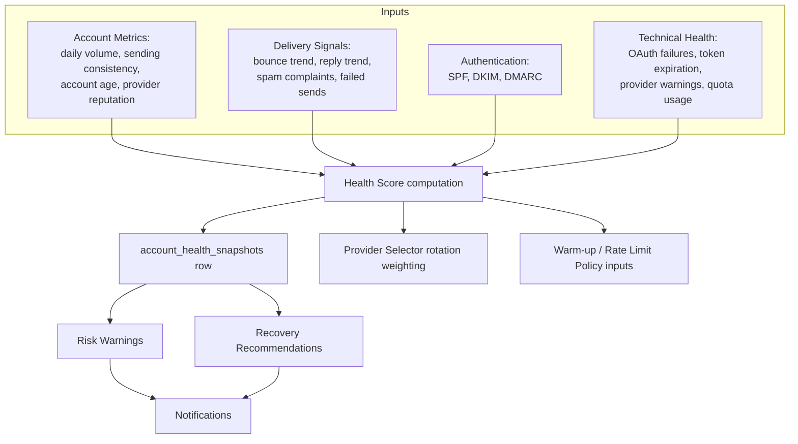

- **Account metrics**: daily volume, sending consistency (variance in day-to-day volume — a sudden spike is itself a risk signal), account age, provider-reported reputation where exposed.
- **Delivery signals**: bounce trend, reply trend, spam complaints (where the provider surfaces them), failed-send rate — sourced from the Conversation Engine (bounce/reply detection, Section 11) and the delivery pipeline (Section 16).
- **Authentication**: periodic DNS-level checks of the sending domain's SPF, DKIM, and DMARC posture.
- **Technical health**: OAuth failure counts, upcoming token expiration, provider warning notices, quota usage against provider-side sending limits.

### 19.3 Output

- **Health score** — a single normalized score (`account_health_snapshots.health_score`) plus a categorical `risk_level` (`healthy` / `watch` / `at_risk` / `critical`).
- **Risk warnings** — specific, explained findings (`account_health_findings`), not a bare number.
- **Recovery recommendations** — concrete next actions (e.g., "reduce daily volume by 30% for 5 days," "reconnect this account," "verify the DKIM record for this sending domain").

This feeds three consumers directly: the **Provider Selector**'s rotation weighting (Section 16.3), the **Scheduling Policy Engine**'s Warm-up and Rate Limit policies (a degraded account automatically gets a tighter proposed cap, Section 15.2), and the **Account Health Dashboard** (Section 20.5).

---

## 20. Analytics & Insights Architecture

### 20.1 Event-sourced write side, materialized read side

Every meaningful occurrence (`sent`, `delivered`, `bounced`, `replied`, `positive_reply`, `unsubscribed`, `conversion`, and optionally `opened`/`clicked`) is appended to the `events` table — an immutable log. Dashboards never query this log directly at read time for aggregates; a background worker periodically recomputes rollup tables per campaign/template/subject/account.

### 20.2 Primary metrics (revised)

**Open Rate is removed as a primary metric.** Reasons, stated plainly and surfaced to the user in-product:

- Apple Mail Privacy Protection pre-fetches images regardless of whether a human opened the message.
- Gmail's own image-proxying/caching behavior can register an "open" independent of recipient action.
- Corporate security scanners routinely pre-fetch links and images, generating opens with no human behind them.
- The net effect is a metric with a high, unpredictable false-positive rate — not merely "somewhat noisy," but actively misleading as a primary signal.

**Primary metrics** are instead:

- **Reply Rate**
- **Positive Reply Rate** — requires a lightweight classification signal; in the initial scope this is a user-applied reply label (e.g., "Interested" / "Not Interested" / "Out of Office"), with optional AI-assisted classification as a later, explicitly-opted-into extension (Section 25) — never silently automatic.
- **Bounce Rate**
- **Delivery Rate**
- **Campaign Conversion** — a user-defined goal event (e.g., "meeting booked," "marked Won"), recorded as an `events` row with `event_type = conversion`, either applied manually today or, in the future, triggered by a CRM/calendar integration (Section 25).

**Open Rate and Click Rate remain available as explicitly opt-in, clearly-labeled secondary/unreliable metrics**, per campaign, never presented as ground truth and never silently enabled — this both formalizes and slightly hardens the original design's stance (which already treated tracking pixels as off-by-default and unreliable).

### 20.3 Insights Engine

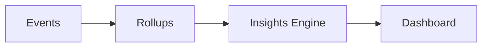

Where the original design stopped at "Rollups → Dashboard," the Insights Engine sits between them and turns raw aggregate deltas into causally-linked, explained observations — e.g., not merely

> "500 emails sent"

but

> "Sending volume increased 40% this week, but reply rate decreased, because most of the added volume went to cold (never-contacted) domains."

It is built on the same rule-registry pattern as the Deliverability Engine and Gmail Compatibility Layer, for consistency: a registry of **Insight Rules**, each pattern-matching over rollup deltas and emitting an `Insight` (Section 5.9) with a severity, a plain-language explanation, and a recommended action.

- **Trends** — multi-period rollup comparisons (week-over-week, campaign-step funnels).
- **Warnings** — a metric crossing a configured or learned threshold (e.g., bounce rate exceeding a safe ceiling for an account).
- **Anomaly detection** — statistical (threshold/z-score-based) flagging of sudden reply-rate cliffs or bounce-rate spikes per campaign/account, distinguishing a real problem from ordinary week-to-week noise.
- **Recommendations** — a concrete next action tied to each insight, in keeping with the cross-cutting "explain, don't just flag" rule.

### 20.4 Feedback into scheduling

Insight Engine output specifically about reply-rate-by-hour or reply-rate-by-domain feeds back into the Smart Scheduler Engine's Business Hours Policy tuning (Section 15.5) as an optional, explicit input — the system gets better at pacing over time without that logic living inside the Scheduler itself.

### 20.5 Dashboards

- **Campaign dashboard**: sent/delivered/replied/bounced counts and rates over time (primary metrics per Section 20.2), per-step funnel, stop-reason breakdown.
- **Template & subject analytics**: reply rate per variant, feeding the weighting mechanism (Section 5.6).
- **Account health dashboard**: driven directly by the Account Health Engine (Section 19) — trend, current health score, risk level, reauth status, recovery recommendations.
- **Deliverability dashboard**: aggregated findings from the Deliverability Engine (Section 17) across recent sends, by category and severity, each with its plain-language explanation.
- **Insights feed**: the Insights Engine's running feed of trends, warnings, and recommendations across all campaigns/accounts.

---

## 21. Background Worker Architecture

### 21.1 Worker types

| Worker | Trigger | Responsibility |
|---|---|---|
| **Scheduler tick** | Fixed interval (e.g., every 30–60s) | Run due `campaign_enrollments` through the Scheduling Policy Engine, hand proposals to the Queue |
| **Send worker** | Claims from `send_queue` | Executes Rate Limiter → Provider Selector → Provider Adapter → Delivery for one message at a time per account (bounded concurrency per account) |
| **Sync worker** | Fixed interval per account + optional push webhook | Executes Conversation Engine ingestion (Section 11) |
| **Deliverability sweep** | Fixed interval (e.g., hourly/daily) | Recomputes account/campaign-scoped Deliverability Engine findings |
| **Account health sweep** | Fixed interval (e.g., hourly) | Recomputes Account Health Engine snapshots and findings (Section 19) |
| **Analytics rollup** | Fixed interval or on-event | Recomputes materialized rollups from the events log |
| **Insights worker** | Fixed interval, after rollups | Runs the Insight Rule registry against fresh rollups (Section 20.3) |
| **Token refresh** | Ahead of expiry, per account | Refreshes OAuth access tokens proactively |
| **Backup** | User-configured schedule | Database backup/export (Section 23) |

### 21.2 Concurrency model

Single-user desktop scale does not need a distributed job system. Workers run as a bounded pool of concurrent tasks within the one privileged process, coordinated purely through the database as the source of truth for "what's due" — this is what makes the whole system crash-recoverable for free: on restart, workers simply resume by querying the same due-work tables, with no separate durable-queue infrastructure to reconcile.

### 21.3 Failure isolation

Each worker type fails independently: a sync failure on one account does not block send workers for other accounts; a single message's send failure does not stall the rest of the queue. Errors are logged with enough context (account, message id, stage) to diagnose without exposing message content in logs by default (Section 23).

---

## 22. Data Flow Diagrams

### 22.1 Manual compose → send (through the revised pipeline)

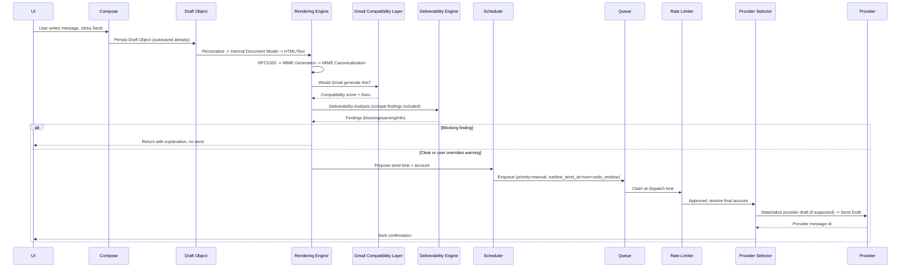

### 22.2 Campaign step execution → reply stops sequence (Conversation Engine driven)

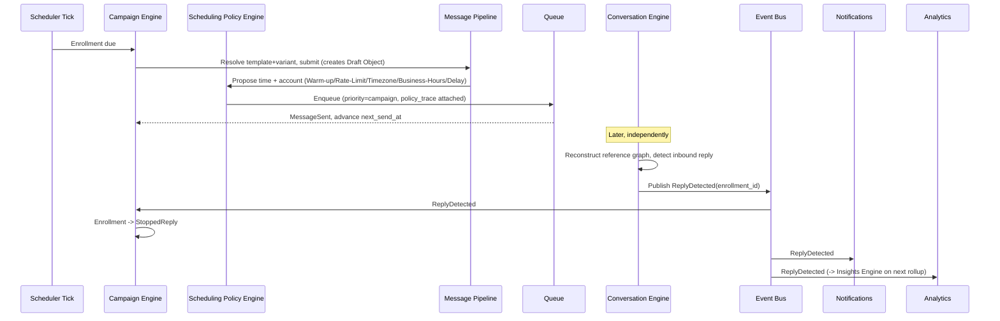

### 22.3 CSV import → suppression-aware enrollment

```mermaid
flowchart LR
    CSV[CSV File] --> Parse[Parse + sanitize\n(formula-injection stripped, encoding normalized)]
    Parse --> Dedup[Duplicate detection\n against existing contacts]
    Dedup --> Suppress{On suppression list?}
    Suppress -- Yes --> Skip[Excluded, reported to user]
    Suppress -- No --> Upsert[Upsert into contacts]
    Upsert --> Enroll[Available for campaign enrollment]
```

### 22.4 Deliverability Lab session (no side effects)

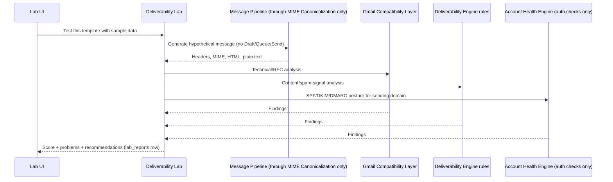

---

## 23. Security Architecture

| Concern | Approach |
|---|---|
| **OAuth tokens** | Never stored in the SQL database. Stored exclusively via the OS-native credential store (Keychain/Credential Manager/Secret Service). The database holds only an opaque reference + non-secret metadata. |
| **Data at rest** | Message bodies and contact PII are sensitive by nature. Database-at-rest encryption is a baseline requirement, using a key sealed by the OS-native secure storage. |
| **Secure IPC** | UI ↔ core communication crosses one typed, schema-validated boundary. Every payload is validated on receipt regardless of which side originated it. |
| **Input validation** | All external input (CSV rows, pasted HTML, provider API responses) is treated as untrusted and validated/sanitized at the boundary it enters. Pasted HTML specifically is parsed into the Internal Document Model (Section 8.1), never passed through. |
| **CSV safety** | Cells beginning with `=`, `+`, `-`, `@` are neutralized on import and re-export; field/row size limits prevent pathological files from exhausting memory. |
| **Attachment safety** | MIME-type sniffing, configurable size ceilings, and an extension allowlist/warn-list before attaching or accepting inbound attachments for preview. |
| **HTML sanitization** | Both outbound compose HTML and inbound synced HTML are sanitized/parsed against an explicit allowed-node schema before rendering or sending. |
| **Database integrity** | Write-ahead logging / equivalent crash-safe transaction mode, foreign-key constraints enforced, migrations applied transactionally with a recorded schema version. |
| **Crash recovery** | Draft autosave (Section 6, 7), durable queue (Section 16), and worker resumption from DB state (Section 21) together mean a crash mid-send or mid-compose loses no user work and creates no duplicate sends. |
| **Logging** | Structured logs capture stage/account/message-id/error type; message *content* and *token material* are excluded from logs by default. |
| **Least privilege OAuth scopes** | Only the scopes required for send + sync are requested. |
| **Backup files** | Exported backups are encrypted with a user-supplied passphrase separate from the app's own at-rest key. |

---

## 24. Testing Architecture

Required and previously missing from this document. The hexagonal core (Section 1.2) exists specifically to make most of this tractable without spinning up real infrastructure — the domain core is I/O-free by construction, so the bulk of the business logic below is unit-testable in isolation.

### 24.1 Unit tests

Pure-logic, no I/O, fast, run on every change:

- **Scheduler and each Policy independently** — Business Hours, Timezone, Warm-up, Rate Limit, and Delay policies each tested as pure functions against calendar/timezone edge cases (DST transitions, midnight rollovers, leap years) without a database.
- **MIME Builder** — structural correctness (Section 9.3) and Canonicalization (Section 9.4) tested separately, per their distinct contracts.
- **Rendering Engine** — Internal Document Model → HTML Renderer and → Plain Text Renderer, verified to always represent equivalent content (Section 8.2).
- **Conversation Engine** — header-graph reconstruction, participant matching, duplicate detection, and thread-merge logic (Section 11), tested against constructed header sequences including malformed/partial reference chains.
- **Gmail Compatibility Layer and Deliverability Engine rule registries** — each rule tested independently against constructed `MessageContext` fixtures.
- **Insights Engine rule registry** — each Insight Rule tested against constructed rollup-delta fixtures.

### 24.2 Integration tests

Exercise real protocol/API behavior:

- **Gmail API**, **Microsoft Graph**, **SMTP** — run against either a sandbox/test account or the Provider Mocks below, gated so real-API tests (which require live credentials and are slower/rate-limited) run less frequently than mock-based tests, which run on every build.

### 24.3 Provider mocks

- **Fake Gmail Provider**, **Fake Outlook Provider**, **Fake SMTP Server** — each implements the same `MailProvider` interface (Section 12.1) as the real adapters, so every layer above the Provider Layer can be tested without ever touching the network. The fakes deliberately simulate provider-specific failure modes (rate-limit errors, auth failures, malformed/partial responses, draft-unsupported behavior) so resilience logic (Section 16.4's idempotency/backoff) is exercised, not just the happy path.

### 24.4 Queue testing

- **Retries** — transient failures correctly re-enter the queue with backoff.
- **Failures** — permanent failures correctly terminate without retry and surface to Notifications.
- **Ordering** — manual priority correctly preempts campaign priority within the same account window.
- **Rate limits** — concurrent claim attempts against the Rate Limiter never allow an account to exceed its ceiling, including under simulated race conditions (multiple send workers claiming near-simultaneously).

### 24.5 Load testing

- Thousands of campaigns, large queues, multiple accounts — verifying the DB-backed queue polling approach (Section 16, 21) holds up at the scale a power user might reach (tens of thousands of enrollments), and that the index choices in Section 5.10 keep the hot-path queries (`send_queue` by status/time, `campaign_enrollments` by status/next_send_at) fast at that scale.

### 24.6 Migration testing

- Every schema migration tested both forward (applies cleanly against a snapshot of realistically-shaped existing data) and for safe, versioned rollback — never assumed safe just because it ran once against an empty database.

### 24.7 MIME Compatibility Testing

```mermaid
flowchart LR
    Gen[Generate Outboundly MIME] --> Cmp[Compare against\nreal Gmail-generated MIME fixtures]
    Cmp --> Diff[Diff\n(normalized via MIME Canonicalization rules,\nso the diff highlights meaningful deviations only)]
    Diff --> Report[Report]
```

A standing, automated test suite that generates Outboundly output for a fixed set of representative messages (plain reply, multipart HTML+attachment, inline images, long thread) and diffs it against golden fixtures captured from real Gmail-generated MIME. Validates headers, multipart structure, encoding, boundary generation, thread headers, and character encoding. This is the concrete, checkable expression of the Guiding Philosophy — not an aspiration, but a CI gate.

### 24.8 Deliverability regression tests

A standing suite — built on the MIME Compatibility fixtures, the Gmail Compatibility Layer's rule set, and the Deliverability Engine's rule registry — that fails CI if a code change would silently reduce MIME compatibility, RFC compliance, or known-good provider acceptance. This is what prevents a future "helpful" change to the Rendering Engine or MIME Canonicalization layer from quietly reintroducing exactly the malformed-HTML/broken-MIME problems this entire architecture exists to avoid.

---

## 25. Future Expansion Strategy

The hexagonal boundary is what makes each of these additive rather than a rewrite:

- **REST API**: an additional adapter sitting *next to* the UI, calling the same application/use-case layer through the same typed contracts. The domain core does not change.
- **Mobile companion**: a client of that future REST API, or of a thin sync protocol built on the same event log.
- **Plugin architecture**: natural extension points already exist by design — new `DeliverabilityRule` registrations (Section 17.1), new Insight Rules (Section 20.3), and new `MailProvider` adapters (Section 12) — all addable without touching core logic.
- **AI-assisted features** (personalization suggestions, subject-line ideation, and eventually the Positive Reply classification hinted at in Section 20.2): modeled as an *optional* pipeline stage, off by default, whose output is still subject to the full downstream Gmail Compatibility Layer and Deliverability Analysis like anything else — AI-generated content gets no special exemption from the same quality bar.
- **CRM / calendar integrations**: modeled as additional adapters behind the existing `Leads`/`Contacts` and `Scheduler` ports, and as a source of `conversion` events (Section 20.2) rather than a rewrite of Analytics.
- **Multi-device sync**: an explicit, opt-in feature built on the future REST API layer, deliberately not a default assumption, preserving the local-first design's privacy/ownership advantage for users who never want a cloud component at all.

---

## 26. Risks, Trade-offs, and Design Decisions

| Decision | Alternative considered | Why this choice | Residual risk |
|---|---|---|---|
| Local-first, no mandatory backend | SaaS/multi-tenant backend (Instantly's model) | Matches the single-user brief exactly; better privacy, no hosting cost, full user data ownership | No built-in multi-device sync unless the user later opts into the future REST API/companion (Section 25) |
| Every outbound message is a Draft Object first, even campaign sends | Compose → generate MIME → send directly | Unifies manual and automated paths at the earliest possible point; gives autosave, mid-flight editing, undo, and debuggability uniformly | Slightly more storage/bookkeeping overhead per message than a stateless generate-and-send call |
| Internal Document Model as rendering source of truth | Store/manipulate HTML strings directly | Makes malformed HTML structurally impossible to emit, and guarantees HTML/plain-text parity | Requires a parser for imported/pasted HTML into the model, and a constrained (not fully general) content schema |
| MIME Generation and MIME Canonicalization as separate stages | One fused "build the MIME" step | Each is independently testable; Canonicalization is the clean seam for diffing against real Gmail MIME | Slightly more pipeline stages to reason about |
| Gmail Compatibility Layer as a distinct subsystem delegated to by the Deliverability Engine | Fold RFC/MIME checks directly into the Deliverability Engine's own rules | Avoids two competing rule sets that could disagree; reused by the Lab and the MIME Compatibility Testing suite | Requires discipline to keep the delegation boundary clean as both systems evolve |
| Account Health Engine separate from Deliverability Engine | One combined "quality" engine | Message/campaign-scoped judgment and account-scoped judgment have different lifecycles, different consumers (Provider Selector, Scheduling policies), and different refresh cadences | Two engines to keep conceptually distinct instead of one — mitigated by a clear, stated scope boundary (Section 19.1) |
| Scheduler orchestrates independent policy objects rather than embedding rules | One monolithic Scheduler with inline business rules | Each policy is independently testable and independently replaceable (e.g., swap Delay Policy's jitter strategy without touching Business Hours) | More interfaces/seams than a single function, justified by the maintainability goal |
| Rate Limit Policy (predictive) and Rate Limiter (authoritative) both exist | A single rate-limit check | "Propose early, confirm late" avoids obviously-bad proposals cheaply while guaranteeing correctness at the only point that actually matters (dispatch time) | Could look like duplicated logic if the distinction isn't documented — addressed explicitly in Section 15.4 |
| Conversation Engine as active logic distinct from the `threads` table | Treat `threads` table plus provider thread IDs as sufficient | Provider thread IDs don't exist for SMTP/IMAP and can't be trusted alone for merge/dedupe across accounts; header-graph reconstruction is the only universal mechanism | More complex sync logic than "trust the provider's thread ID" |
| Open Rate demoted from primary to secondary/unreliable metric | Open Rate as a headline metric (Instantly's model) | Apple MPP, Gmail image caching, and corporate scanners make it structurally unreliable; Reply/Bounce/Delivery/Conversion are trustworthy | Users coming from tools that foreground open rate may expect it front-and-center; needs clear onboarding messaging |
| Deliverability Lab as a separate, side-effect-free tool from the live Deliverability Engine | One engine, always live | Lets users iterate on templates without any risk of a stray send or account interaction | Two entry points to the same underlying rules to keep in sync — mitigated by both consuming the same rule registries, never duplicating them |
| OAuth via PKCE only, no embedded confidential secret | Embed a client secret in the desktop binary | Both providers document desktop client secrets as non-secret; PKCE is the current best practice | If a future provider mandates a true confidential client, a minimal token-exchange relay becomes necessary (Section 13.4) |
| Durable, DB-backed queue instead of an external broker | Redis/RabbitMQ-backed queue | No extra infrastructure appropriate for a single-user desktop app; DB transactions already give durability | Throughput ceiling far below what's needed here — a non-issue at this product's scale |
| Hexagonal/ports-and-adapters core | Framework-coupled MVC-style app | Every module genuinely replaceable, testable without I/O, and future-proof for API/mobile expansion | Slightly more upfront structure/ceremony than a quick monolithic script would need |

---

## 27. Recommended Technology Stack (With Justification)

Deferred until now, as instructed. Presented as: recommendation, and what was rejected and why. The additions in this revision (Rendering Engine, Conversation Engine, MIME Canonicalization, Gmail Compatibility Layer, provider mocks) are all achievable within the same stack recommended previously — this section adds testing-specific tooling but does not change the core recommendation.

| Layer | Recommendation | Rejected alternative(s) | Why |
|---|---|---|---|
| **Desktop shell** | Electron (Chromium + Node runtime), strict process separation: domain core + workers + DB in the main process; UI in a sandboxed, context-isolated renderer with no Node integration | Tauri (Rust core + system WebView) | The mail ecosystem (MIME building, IMAP clients, official Gmail/Graph SDKs, OAuth desktop libraries) is dramatically more mature in the Node/TypeScript ecosystem than in Rust today — decisive for a product whose value proposition rests on message-generation and provider-integration correctness. Electron's known security footguns are mitigated by the strict process-separation rule (Section 1.3). |
| **Language** | TypeScript everywhere (core, adapters, workers, UI, tests) | Mixed-language (e.g., Rust core + JS UI) | One language across the whole codebase lowers long-term maintenance cost; TypeScript's structural typing suits the ports/adapters and policy-object interfaces well. |
| **UI framework** | React | Vue, Svelte | Largest ecosystem of accessible, well-tested rich-text/editor components and desktop-app UI kits. |
| **Rich text / compose editor** | Tiptap (ProseMirror-based), its document schema serving as (or mapping directly onto) the Internal Document Model | Quill, Draft.js, a contentEditable-from-scratch build | ProseMirror-based editors give fine-grained control over the serialized HTML schema — essential for the Rendering Engine's (Section 8) guarantee of clean, deliverability-safe output. |
| **Database** | SQLite (embedded, single file) | Postgres/MySQL (would require running a local server process) | Single-user, local-first, offline-capable by definition. SQLite gives full ACID transactions, strong indexing, trivial backup, zero operational overhead. |
| **DB access / migrations** | A TypeScript-first ORM/query builder with first-class SQLite support and schema-as-code migrations (e.g., Drizzle-style) | Hand-written SQL strings everywhere | Type-safe queries catch schema drift at compile time; schema-as-code migrations satisfy the migration-testing requirement (Section 24.6) directly. |
| **At-rest encryption** | SQLite with a transparent encryption extension (SQLCipher-class), key sealed via OS keychain | Application-level field encryption only | Whole-database encryption is simpler to reason about and audit than per-field encryption. |
| **Credential vault** | OS-native secure storage via a maintained native-keychain binding, plus the desktop shell's own secure-storage API as a fallback layer | A custom-rolled encrypted file for tokens | OS keychains are the standards-based, audited mechanism every reputable desktop credential-storing app uses. |
| **Google integration** | Official Google API client + Google's installed-app OAuth library (PKCE, loopback redirect) | Raw HTTP calls against Gmail REST endpoints | Official SDKs track API changes, handle pagination/retry conventions, and are the documented, supported path — including native draft support (Section 7). |
| **Microsoft integration** | Official Microsoft Graph SDK + Microsoft's public-client authentication library (PKCE) | Raw HTTP calls against Graph endpoints | Same rationale; the only realistic way to consume Graph delta queries, change notifications, and native drafts correctly. |
| **SMTP/IMAP fallback** | Mature, actively maintained open-source SMTP client and IMAP client libraries, plus a standards-compliant MIME builder/parser pair | Hand-rolled SMTP/IMAP/MIME implementation | RFC 5322/MIME correctness is exactly the kind of detail-heavy, footgun-prone code that should not be reinvented. |
| **Background jobs / queue** | Custom lightweight worker pool polling the SQLite-backed `send_queue`/`campaign_enrollments` tables directly (no external broker) | Redis + BullMQ or similar | Adding a Redis dependency to a single-user desktop app means shipping and managing a second process for no real throughput benefit at this scale. |
| **Packaging & auto-update** | The Electron ecosystem's standard builder + updater tooling, with code signing/notarization on every platform | Manual/no auto-update | A "commercial product" expectation includes trustworthy, signed auto-updates. |
| **Unit/integration test runner** | A fast, TypeScript-native test runner (e.g., Vitest-class tooling) for the I/O-free core (Section 24.1) plus adapter integration tests (Section 24.2) | Manual testing only | The domain core's explicit I/O-free design is what makes fast, comprehensive unit testing realistic in the first place. |
| **Provider mocks** | Hand-built fakes implementing the `MailProvider` interface directly (Section 24.3), not a generic HTTP-mocking library alone | Recorded HTTP fixtures/cassettes only | Interface-level fakes can simulate provider-specific behavioral quirks (draft-unsupported, rate-limit errors) that a bare HTTP-replay fixture can't express cleanly. |
| **E2E / UI testing** | A browser-automation tool driving the actual packaged Electron app | Manual UI testing only | Verifies the compose/campaign/dashboard flows a power user actually clicks through, on top of the unit/integration layers below it. |
| **MIME compatibility fixtures** | A small, version-controlled set of real Gmail-generated MIME captures (via the Gmail API's raw message export) used as golden files in the MIME Compatibility Testing suite (Section 24.7) | Synthetic/hand-written "expected" MIME | Only real captured output can validate the Guiding Philosophy's claim ("as though Gmail itself composed it") against ground truth rather than against the team's own assumptions. |

### On sequencing

This stack is a recommendation to evaluate, not a commitment already acted on — consistent with the instruction that no implementation begins until this whole document is reviewed and approved.

---

## 28. Open Questions Requiring Your Sign-Off

Before any code is written, these decisions should be explicitly confirmed (or redirected):

1. **Open Rate demoted to secondary/unreliable** (Section 20.2) — confirm this stronger stance (removed from primary metrics entirely, not just off-by-default) is what you want.
2. **Deliverability gate as blocking, not advisory-only** (Section 17.4) — confirm hard blocks on `blocking`-severity findings (with override) rather than a warn-only posture everywhere.
3. **Every message becomes a real Draft Object before send, including every campaign step** (Section 7) — confirm the storage/bookkeeping overhead this implies (a `drafts` row and, where supported, a provider-side draft, for every single campaign send) is an acceptable trade for the debuggability/editability/undo benefits.
4. **Electron vs. Tauri** (Section 27) — confirm the ecosystem-maturity trade-off is acceptable versus Tauri's smaller footprint/attack surface.
5. **SQLite as the sole datastore** (Section 27) — confirm no scenario in your plans changes this before implementation starts.
6. **Positive Reply Rate's initial definition** (Section 20.2) — confirm starting with manual user-applied labels (rather than an automatic classifier) is acceptable for v1.
7. **Whole-database encryption approach and backup passphrase UX** (Section 23) — confirm the intended user experience for first-run key setup and backup/restore.
8. **Scope of "v1"** — this document specs the full product, now materially larger than the previous draft (Conversation Engine, Gmail Compatibility Layer, Account Health Engine, Deliverability Lab, Insights Engine, and the full Testing Architecture are all new). Confirm whether an initial implementation phase should sequence a deliberately narrow subset (e.g., Google-only, single account, manual-send-first, Draft Lifecycle + Rendering Engine + basic Deliverability Engine, with Conversation Engine/Account Health/Insights/Lab following in later phases) before attempting the full breadth described here.

Nothing in this document has been implemented. Awaiting review, questions, and explicit approval before any code, scaffolding, or dependency is introduced.
