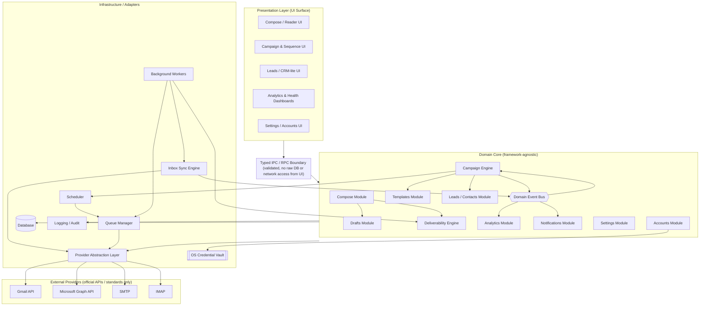
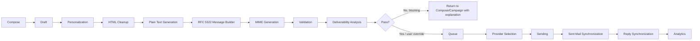
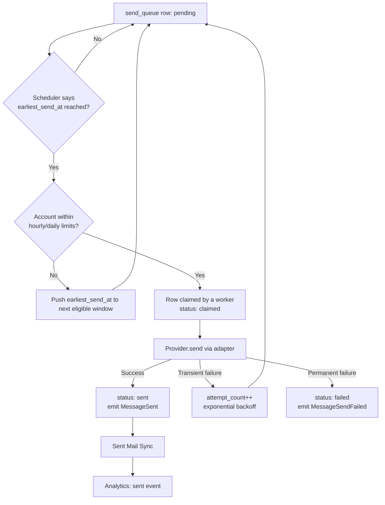
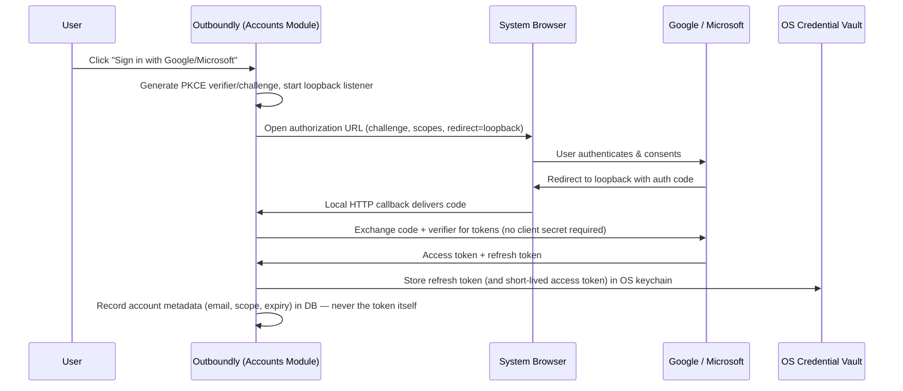
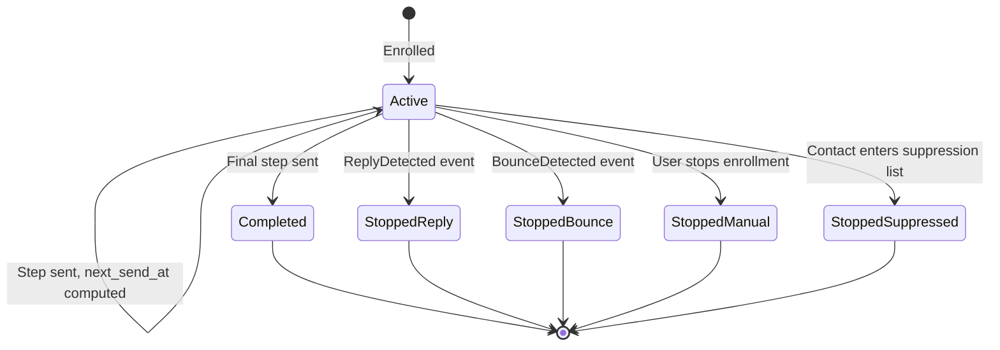
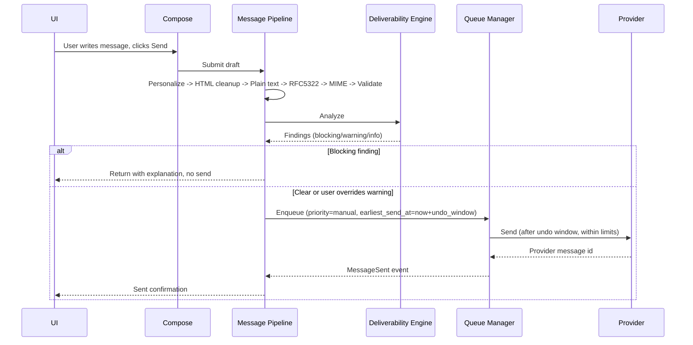
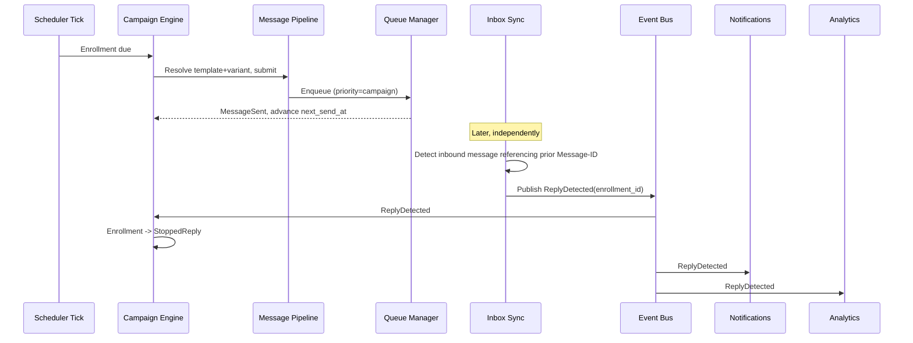

# Outboundly — Architecture Design Document

**Status:** DRAFT — pending explicit review and approval. No implementation should begin against this document until it is signed off.

**Scope:** Single-user desktop outreach application. No teams, no multi-tenancy, no roles, no billing, no workspaces. One person, many connected email accounts, professional-grade compose quality, and an outreach engine that treats deliverability as a first-class engineering concern rather than an afterthought.

Technology choices are deliberately deferred to Section 22. Everything before that is described in framework-agnostic terms so the architecture stands on its own merits before any implementation bias enters the picture.

---

## Table of Contents

1. [Complete Product Architecture](#1-complete-product-architecture)
2. [System Architecture Diagram](#2-system-architecture-diagram)
3. [Module Breakdown](#3-module-breakdown)
4. [Folder Structure (High Level)](#4-folder-structure-high-level)
5. [Database Schema](#5-database-schema)
6. [Compose Architecture](#6-compose-architecture)
7. [Message Generation Pipeline](#7-message-generation-pipeline)
8. [Delivery Pipeline](#8-delivery-pipeline)
9. [Provider Abstraction Design](#9-provider-abstraction-design)
10. [OAuth Architecture](#10-oauth-architecture)
11. [Inbox Synchronization Architecture](#11-inbox-synchronization-architecture)
12. [Campaign Engine Architecture](#12-campaign-engine-architecture)
13. [Queue System](#13-queue-system)
14. [Scheduler Architecture](#14-scheduler-architecture)
15. [Deliverability Engine Architecture](#15-deliverability-engine-architecture)
16. [Analytics Architecture](#16-analytics-architecture)
17. [Background Worker Architecture](#17-background-worker-architecture)
18. [Data Flow Diagrams](#18-data-flow-diagrams)
19. [Security Architecture](#19-security-architecture)
20. [Future Expansion Strategy](#20-future-expansion-strategy)
21. [Risks, Trade-offs, and Design Decisions](#21-risks-trade-offs-and-design-decisions)
22. [Recommended Technology Stack (With Justification)](#22-recommended-technology-stack-with-justification)
23. [Open Questions Requiring Your Sign-Off](#23-open-questions-requiring-your-sign-off)

---

## 1. Complete Product Architecture

### 1.1 Governing principle

Outboundly is **one domain core with two faces**: a Gmail-grade compose/read experience, and an Instantly-grade automation engine. Both faces operate on the *same* messages, the *same* accounts, and the *same* deliverability rules. They are not two bolted-together products — a manual reply and a campaign step are both, structurally, "a message entering the send pipeline." This is the single most important architectural decision in this document, and everything else follows from it.

### 1.2 Architectural style

**Hexagonal architecture (Ports & Adapters)** with an internal **domain event bus**, and a light **CQRS split** for analytics (write-side events, read-side rollups).

- **Domain core**: compose rules, deliverability rules, campaign/sequence logic, scheduling logic, lead/contact rules. Pure logic, no I/O, fully unit-testable without a database, network, or UI.
- **Ports**: interfaces the domain core depends on — `MailProvider`, `Repository<T>`, `Clock`, `TokenVault`, `EventBus`.
- **Adapters**: concrete implementations — Gmail API adapter, Graph API adapter, SMTP/IMAP adapter, SQL repository implementations, OS keychain adapter.
- **Domain events**: `MessageSent`, `ReplyDetected`, `BounceDetected`, `MessageQueued`, `AccountHealthDegraded`, `UnsubscribeRequested`, etc. Modules communicate primarily by publishing/subscribing to these events rather than calling each other directly. This is what lets "Campaign Engine stops sequence on reply" and "Inbox Sync detects reply" remain in two separate modules that never import one another.

Why this style, for this product specifically: a desktop outreach tool has many features that all react to the same underlying events (a reply should stop a campaign, unblock a "waiting on reply" label, update analytics, and clear a follow-up reminder — four modules, one event). An event-driven core avoids a tangle of direct cross-module calls and keeps every module replaceable in isolation, which is one of your explicit requirements.

### 1.3 Process/runtime shape (framework-agnostic)

Regardless of the eventual desktop shell:

- **One privileged process** owns the domain core, the database, background workers, credential vault access, and all network I/O to providers.
- **One (or more) UI surface(s)** are strictly presentation — they render state and dispatch intents. They never touch the database, network credentials, or filesystem directly.
- All UI ↔ core communication crosses a **typed, validated boundary** (an internal RPC contract), never an ad-hoc shared-memory or "just require the module" shortcut, even if both sides happen to run in the same OS process. This boundary is what makes a future mobile companion or REST API additive rather than a rewrite (Section 20).

### 1.4 What Outboundly explicitly is not

- Not a mail server. Outboundly is a client to existing, official provider APIs (Gmail API, Microsoft Graph, standards-based SMTP/IMAP). It never implements SMTP server behavior, never operates as an open relay, never forges sending domains.
- Not a spam tool. There is no code path whose purpose is to evade filters. The deliverability engine's job is to make messages *legitimately* better, not to disguise bad ones.
- Not multi-tenant. There is one local identity (the user), N connected mailbox accounts, and no concept of "organization."

---

## 2. System Architecture Diagram



---

## 3. Module Breakdown

Each module owns exactly one responsibility and exposes a narrow interface. "Depends on" means "depends on the interface/port," never the concrete adapter.

| Module | Responsibility | Depends on | Publishes events | Subscribes to |
|---|---|---|---|---|
| **Compose** | Turn user input into a validated draft message (rich text, attachments, inline images, personalization tokens, signature) | Templates, Deliverability Engine (advisory) | `DraftSaved`, `MessageSubmittedForSend` | — |
| **Drafts** | Persist and autosave in-progress messages, restore on crash/restart | Database | `DraftSaved`, `DraftDiscarded` | — |
| **Templates** | Store reusable bodies, subjects, and variants (weighting) | Database | `TemplateUpdated` | — |
| **Campaign Engine** | Own sequences, enrollments, step progression, stop conditions | Leads, Templates, Scheduler, Queue Manager | `EnrollmentAdvanced`, `SequenceCompleted`, `SequenceStopped` | `ReplyDetected`, `BounceDetected`, `UnsubscribeRequested` |
| **Leads / Contacts** | Store contact records, history, notes, labels, suppression status | Database | `LeadSuppressed`, `LeadImported` | `ReplyDetected`, `BounceDetected` |
| **Accounts** | Manage connected mailbox accounts, OAuth lifecycle, per-account sending limits/config | Credential Vault, Provider Layer | `AccountConnected`, `AccountDisconnected`, `AccountHealthDegraded` | — |
| **Provider Layer** | Abstract Gmail / Microsoft / SMTP / IMAP behind one `MailProvider` interface | External APIs | — | — |
| **Deliverability Engine** | Evaluate a message/campaign/account against deliverability rules and explain findings | (pure logic; reads config + message) | `DeliverabilityIssueFound` | — |
| **Inbox Synchronization** | Pull new mail, detect replies/bounces, maintain threads | Provider Layer, Database | `ReplyDetected`, `BounceDetected`, `NewMessageSynced` | — |
| **Analytics** | Record events, compute rollups, serve dashboard queries | Database | — | (almost) every domain event |
| **Queue Manager** | Central outbound queue: rate limits, account rotation, priority | Database, Provider Layer | `MessageQueued`, `MessageSent`, `MessageSendFailed` | — |
| **Scheduler** | Compute the next eligible send time per message (business hours, timezone, cadence) | Settings, Campaign Engine | — | — |
| **Background Workers** | Execute long-running/periodic jobs (sync, send, health checks) | Queue Manager, Sync, Deliverability Engine | — | — |
| **Notifications** | Surface in-app alerts (reply arrived, campaign paused, account health issue) | — | — | most domain events |
| **Settings** | User preferences, sending defaults, signatures-by-account, business hours | Database | `SettingsChanged` | — |
| **Logging / Audit** | Structured logs, error capture, send audit trail | — | — | — |
| **Database** | Storage, migrations, transactions | — | — | — |

---

## 4. Folder Structure (High Level)

Logical structure, expressed by module boundary rather than by framework. This is what the hexagonal architecture looks like on disk, independent of the final language/framework choice:

```
outboundly/
├── core/                        # Pure domain logic — no I/O, fully unit-testable
│   ├── compose/
│   ├── drafts/
│   ├── templates/
│   ├── campaigns/
│   ├── leads/
│   ├── accounts/
│   ├── deliverability/
│   ├── analytics/
│   ├── scheduling/
│   └── shared-kernel/            # Value objects: EmailAddress, MimeMessage, ThreadId, etc.
│
├── ports/                        # Interfaces the core depends on
│   ├── mail-provider.port.ts
│   ├── repository.port.ts
│   ├── token-vault.port.ts
│   ├── clock.port.ts
│   └── event-bus.port.ts
│
├── adapters/                     # Concrete implementations of ports
│   ├── providers/
│   │   ├── google/
│   │   ├── microsoft/
│   │   ├── smtp/
│   │   └── imap/
│   ├── persistence/
│   │   ├── migrations/
│   │   └── repositories/
│   ├── credential-vault/
│   └── logging/
│
├── application/                   # Use-case orchestration (thin, calls into core + ports)
│   ├── send-message/
│   ├── enroll-lead/
│   ├── sync-inbox/
│   └── run-deliverability-check/
│
├── workers/                        # Background job definitions
│   ├── send-worker/
│   ├── sync-worker/
│   ├── health-check-worker/
│   └── scheduler-tick/
│
├── ipc-boundary/                   # Typed, validated contract between UI and core
│
├── ui/                              # Presentation layer only
│   ├── compose/
│   ├── unified-inbox/
│   ├── campaigns/
│   ├── leads/
│   ├── dashboards/
│   └── settings/
│
└── shared-config/                    # Non-secret app configuration (OAuth client IDs, redirect URIs)
```

The rule this structure encodes: **`core/` never imports `adapters/` or `ui/`.** Dependencies point inward. This is what "replaceable without affecting other modules" means concretely — swapping SQLite for another store only touches `adapters/persistence`, swapping Electron for another shell only touches `ui/` and `ipc-boundary/`.

---

## 5. Database Schema

Presented as a logical relational schema (engine-agnostic; the concrete engine is chosen in Section 22).

### 5.1 Accounts & Identity

```
accounts
  id (pk), provider (google|microsoft|smtp_imap), email_address, display_name,
  status (connected|reauth_required|disconnected), connected_at, last_synced_at,
  daily_send_limit, hourly_send_limit, warmup_mode (bool), created_at, updated_at

oauth_tokens
  id (pk), account_id (fk -> accounts), provider_token_ref (opaque handle into OS vault),
  scope, expires_at, refresh_status, last_refreshed_at
  -- Actual token material NEVER stored in this table or any SQL table (see Section 19).

account_health_snapshots
  id (pk), account_id (fk), captured_at, bounce_rate, reply_rate,
  spam_complaint_rate (if reported by provider), sends_last_24h, sends_last_7d, health_score
```

### 5.2 Messaging Core

```
threads
  id (pk), account_id (fk), provider_thread_id, subject_normalized, created_at, updated_at

messages
  id (pk), thread_id (fk), account_id (fk), provider_message_id, message_id_header (RFC 5322),
  in_reply_to_header, references_header, direction (inbound|outbound),
  from_address, to_addresses (json), cc_addresses (json), bcc_addresses (json),
  subject, body_html, body_text, snippet, sent_at, received_at,
  status (draft|queued|sending|sent|failed|bounced), campaign_enrollment_id (fk, nullable),
  created_at, updated_at

attachments
  id (pk), message_id (fk), filename, mime_type, size_bytes, storage_ref, is_inline, content_id

drafts
  id (pk), account_id (fk), thread_id (fk, nullable), subject, body_html,
  to_addresses (json), cc_addresses (json), bcc_addresses (json),
  autosave_version, last_saved_at
```

### 5.3 Leads / Contacts

```
contacts
  id (pk), email (unique per user scope), first_name, last_name, company, title,
  timezone, custom_fields (json), source (csv_import|manual|reply), created_at, updated_at

contact_notes
  id (pk), contact_id (fk), body, created_at

suppression_list
  id (pk), email, reason (unsubscribed|bounced_hard|manual|complaint), created_at

labels / contact_labels
  labels: id (pk), name, color
  contact_labels: contact_id (fk), label_id (fk)
```

### 5.4 Templates & Campaigns

```
templates
  id (pk), name, body_html, body_text, created_at, updated_at

template_variants   -- template weighting / A-B/n testing
  id (pk), template_id (fk), variant_label, weight, body_html_override (nullable)

subject_variants
  id (pk), campaign_step_id (fk), subject_text, weight

sequences
  id (pk), name, description, status (draft|active|archived), created_at

sequence_steps
  id (pk), sequence_id (fk), step_order, delay_days, delay_hours,
  template_id (fk), stop_on_reply (bool), stop_on_bounce (bool), condition_json

campaigns
  id (pk), name, sequence_id (fk), sending_account_ids (json, supports rotation),
  business_hours_profile_id (fk), status (draft|running|paused|completed),
  daily_limit_override, created_at

campaign_enrollments
  id (pk), campaign_id (fk), contact_id (fk), current_step_id (fk),
  status (active|stopped_reply|stopped_bounce|stopped_manual|completed),
  next_send_at, enrolled_at, updated_at
```

### 5.5 Queue, Scheduling, Deliverability

```
send_queue
  id (pk), message_id (fk), account_id (fk), priority (manual|campaign),
  earliest_send_at, status (pending|claimed|sent|failed|cancelled),
  attempt_count, last_error, idempotency_key (unique), created_at

business_hours_profiles
  id (pk), name, timezone, windows_json (per-weekday start/end)

deliverability_reports
  id (pk), message_id (fk, nullable), campaign_id (fk, nullable), account_id (fk, nullable),
  scope (message|campaign|account), generated_at,
  overall_score, findings_json (array of {rule_id, severity, explanation})
```

### 5.6 Analytics

```
events
  id (pk), event_type (sent|delivered|bounced|replied|unsubscribed|opened|clicked),
  message_id (fk, nullable), campaign_id (fk, nullable), account_id (fk, nullable),
  occurred_at, metadata_json

campaign_metrics_rollup / template_metrics_rollup / subject_metrics_rollup / account_metrics_rollup
  -- materialized aggregates, recomputed by background worker, never the analytics source of truth
```

### 5.7 Indexing priorities

- `messages`: index on `(account_id, sent_at)`, `(thread_id)`, `(message_id_header)`, `(campaign_enrollment_id)`.
- `contacts`: unique index on `email`; index on labels via join table.
- `send_queue`: index on `(status, earliest_send_at)` — this is the hot path the Queue Manager polls.
- `campaign_enrollments`: index on `(status, next_send_at)` — the hot path the Scheduler polls.
- `events`: index on `(campaign_id, event_type, occurred_at)` and `(account_id, event_type, occurred_at)` for rollup computation.

---

## 6. Compose Architecture

Gmail-grade composing, decomposed:

- **Editor surface**: rich-text editing producing *clean, semantic HTML* — not the bloated markup many WYSIWYG editors emit. This matters directly for deliverability (Section 15): excessive inline styles, `<font>` tags, and Word-style markup are spam-filter signals and bloat the HTML/text ratio.
- **Personalization tokens**: `{{first_name}}`, `{{company}}`, custom fields — resolved at *send time*, not at compose time, so a template remains reusable. Token resolution is a pipeline stage (Section 7), not something the editor does inline, so campaigns and one-off compose share the exact same resolver and the exact same "missing token" validation.
- **Signatures**: per-account, stored as structured content (not baked HTML the user can't edit consistently), inserted as a compose-time default the user can still edit per-message.
- **Attachments & inline images**: attachments stored via content-addressed local storage reference; inline images become `cid:` references in HTML with matching MIME parts — never remote-hosted `` tags for content the user attached (remote-hosted images the user *chooses* to link are a separate, explicit action, and the Deliverability Engine flags an excessive image/text ratio either way).
- **Draft autosave**: every N seconds and on every significant edit, writes to the `drafts` table with an incrementing `autosave_version`; on crash, the UI reopens the latest autosave rather than losing content. This is the same durability guarantee as Gmail's compose box, achieved locally instead of via a server round-trip.
- **Reply / Reply All / Forward**: constructed from the existing thread's headers so `In-Reply-To` / `References` are correct from the moment of composition, not patched on later.
- **Undo Send**: implemented honestly — a compose action places the message into the `send_queue` with `earliest_send_at = now + N seconds` (user-configurable, default ~10s). "Undo" simply cancels the queued row before the Queue Manager claims it. This is the same mechanism Gmail itself uses; there is no real "recall after transmission," and the UI should not imply one.
- **Keyboard shortcuts & minimal-click workflow**: a UI-layer concern, but the compose module's command surface (send, save-draft, discard, attach, insert-template) must be exposed as discrete callable intents so shortcuts and buttons invoke the same code path — no shortcut-only logic.

---

## 7. Message Generation Pipeline

This is the spine of the product. Every outbound message — whether typed by hand or generated by a campaign step — passes through the identical pipeline. That uniformity is intentional: a campaign email should be exactly as standards-compliant as a manually composed one.



Stage contracts (each stage has one input type, one output type, and is independently testable):

1. **Compose** → raw editor state (rich content + attachments + recipient list + template reference).
2. **Draft** → persisted, versioned representation of the above. Idempotent save.
3. **Personalization** → resolves tokens against the recipient's contact record; produces a *fully resolved* content object. Missing/unresolvable tokens are a hard stop here, not discovered later — this prevents "Hi {{first_name}}," from ever reaching a send attempt.
4. **HTML Cleanup** → sanitizes and normalizes HTML: strips editor cruft, inlines only necessary styles, enforces a safe subset of tags, fixes malformed markup, normalizes charset to UTF-8.
5. **Plain Text Generation** → derives a genuine plain-text alternative from the cleaned HTML (not a stub "please view in HTML" placeholder) so the multipart/alternative part is meaningful — a real deliverability factor, and also just correct MIME practice.
6. **RFC 5322 Message Builder** → assembles required headers: `From`, `To`, `Subject`, `Date`, `Message-ID`, `MIME-Version`, correct `In-Reply-To`/`References` for threaded messages, `Reply-To` if configured. Message-ID generation follows the RFC 5322 recommended form (unique-string @ sending-domain) and is stable/deterministic per message so retries don't mint duplicate IDs.
7. **MIME Generation** → builds the correct multipart structure: `multipart/mixed` (attachments) wrapping `multipart/alternative` (text/plain + text/html) wrapping `multipart/related` (inline images), only including the layers actually needed for a given message.
8. **Validation** → structural correctness pass: well-formed MIME, no duplicate headers, valid header folding/line lengths (RFC 5322 line-length limits), correct encoding declarations, valid `Content-Transfer-Encoding` per part.
9. **Deliverability Analysis** → the Deliverability Engine (Section 15) runs its full rule set and returns a scored report with explanations. Findings are categorized as **blocking** (must fix before send — e.g., missing personalization, broken RFC compliance) or **advisory** (shown, overridable — e.g., "image/text ratio is high").
10. **Queue** → accepted messages are handed to the Queue Manager (Section 13) with a priority and earliest-eligible time from the Scheduler (Section 14).
11. **Provider Selection** → the queue resolves *which* provider adapter handles this account (Section 9).
12. **Sending** → the provider adapter performs the actual transmission via the official API/protocol.
13. **Sent Mail Synchronization** → the sent message is reconciled into the local `messages`/`threads` tables (some providers auto-file to Sent; SMTP-only accounts require an explicit append to the Sent folder via IMAP).
14. **Reply Synchronization** → handled by the Inbox Synchronization module (Section 11); threads reply back to the originating message via `In-Reply-To`/`References`/`Message-ID`.
15. **Analytics** → every stage transition and terminal outcome emits a domain event that the Analytics module records (Section 16).

Because campaign-generated messages and manually composed messages both enter at "Personalization" with the same shape of input, the Campaign Engine's only real job is: pick the next contact, pick the next template/subject variant, and hand a resolved intent to this same pipeline. No parallel send path exists anywhere in the system.

---

## 8. Delivery Pipeline

Delivery is the back half of the pipeline above (stages 10–15), viewed from the Queue Manager's perspective:



Key properties:

- **Idempotency**: every queue row carries an `idempotency_key`. If a send worker crashes after the provider accepted the message but before the local status update commits, recovery logic checks "did the provider actually receive this?" (via provider message ID lookup) before ever resending — this is what prevents duplicate sends after a crash, a real and common failure mode in naive queue implementations.
- **Backoff**: transient provider errors (rate limiting, temporary network failure) retry with exponential backoff and a max-attempt ceiling; permanent errors (invalid recipient, auth revoked) fail immediately and surface to the user/Notifications module rather than retrying forever.
- **Single choke point for limits**: hourly/daily caps are enforced *here*, per account, regardless of whether the message originated from a manual send or a campaign step. This directly avoids a common failure in outreach tools where manual sends and automated sends are rate-limited independently and together blow past what an account can safely handle.

---

## 9. Provider Abstraction Design

### 9.1 The contract

```
interface MailProvider {
  authenticate(account: AccountRef): Promise<void>
  sendMessage(message: BuiltMimeMessage): Promise<ProviderSendResult>
  createDraft(message: BuiltMimeMessage): Promise<ProviderDraftRef>
  listChangesSince(account: AccountRef, cursor: SyncCursor): Promise<ChangeSet>
  fetchThread(account: AccountRef, threadRef: string): Promise<NormalizedThread>
  appendToSentFolder(account: AccountRef, rawMessage: Buffer): Promise<void>  // needed for SMTP/IMAP-only accounts
  supportsPushNotifications(): boolean
  registerWatch?(account: AccountRef): Promise<WatchHandle>   // Gmail watch / Graph subscription, where available
}
```

The **compose, campaign, deliverability, and queue modules only ever see this interface** and a `NormalizedMessage` / `NormalizedThread` domain model — never a raw Gmail API payload or a raw Graph payload. All provider-specific field mapping happens inside the adapter.

### 9.2 Adapters

| Adapter | Transport | Sync mechanism | Notes |
|---|---|---|---|
| **Google** | Gmail API (`users.messages.send`, `.threads`, `.history`) | History API (incremental) + optional push via Cloud Pub/Sub watch | Preferred over raw SMTP/IMAP for Google accounts — richer thread/label semantics, better rate-limit transparency |
| **Microsoft** | Microsoft Graph API (`/me/sendMail`, `/me/messages`, delta queries) | Delta query (`/messages/delta`) + optional Graph change notifications (webhooks) | Preferred over raw SMTP/IMAP for Microsoft 365/Outlook accounts |
| **SMTP** | Standards-based SMTP submission (587/STARTTLS or 465/implicit TLS) | N/A (send-only) | For any provider without a first-class API; always paired with an IMAP adapter for the same account |
| **IMAP** | Standards-based IMAP (IDLE where supported, else poll) | UID-based incremental sync | Read/sync counterpart to the SMTP adapter |

### 9.3 Why not a single "just use SMTP/IMAP for everything" approach

It would be simpler to implement one adapter and point it at every provider. It is deliberately rejected: Gmail and Microsoft 365 both expose OAuth-scoped, rate-limit-transparent, thread-aware official APIs that produce a measurably better sync/send experience (proper history cursors instead of IMAP UID gymnastics, documented per-account sending quotas instead of guesswork, native thread IDs instead of `References`-header reconstruction). SMTP/IMAP remains as the universal fallback for every other provider, which is exactly the role it should play.

---

## 10. OAuth Architecture

### 10.1 Design goal restated

The user clicks "Sign in with Google" or "Sign in with Microsoft" and authorizes access. They never see a Client ID, a Client Secret, or a redirect URI configuration screen. Outboundly (the application/vendor) owns one registered OAuth application per provider (one Google Cloud project, one Azure AD app registration), shared by every installation of the app.

### 10.2 Flow (both providers)

- **Authorization Code flow with PKCE (RFC 7636)**, which is the correct, current best practice for installed/native/desktop applications from both Google and Microsoft — it removes the need for a true confidential-client secret at all, because the security boundary is the PKCE code verifier, not a stored secret.
- **Loopback redirect** (`http://127.0.0.1:{ephemeral-port}/callback`), per Google's and Microsoft's own guidance for installed apps (this is what gcloud CLI, Azure CLI, and similar tools do) — a short-lived local HTTP listener receives the redirect, extracts the code, and immediately shuts down.
- Scopes requested are the minimum necessary for the account's declared purpose (send + sync), requested incrementally where the provider supports it, never a broad "full account access" scope out of convenience.



### 10.3 Token lifecycle

- **Storage**: refresh tokens (and, if desired, cached access tokens) live only in the OS-native credential store (Keychain / Credential Manager / Secret Service). The SQL database stores only an opaque reference and metadata (Section 19).
- **Refresh**: a background worker refreshes access tokens proactively before expiry; on refresh failure (revoked consent, expired refresh token), the account transitions to `reauth_required` and Notifications surfaces a one-click "Reconnect" action that repeats the flow above.
- **Disconnect**: revokes the token with the provider (where supported) and purges vault + metadata. Disconnection is a first-class, immediate, local-only action — no server round trip to "our backend" is needed because there is no multi-tenant backend to notify.

### 10.4 On the "embedded secret" question

If a future provider integration insists on a confidential-client credential that cannot use PKCE-only public-client flow, the correct pattern is **not** to embed a real secret in a distributable desktop binary (it is trivially recoverable and both Google and Microsoft explicitly document this). The correct pattern is a minimal, stateless token-exchange relay: a tiny backend endpoint that holds the real secret, accepts only `(auth code, PKCE verifier)`, and returns tokens — it sees no user data and stores nothing. Google and Microsoft's own current desktop flows do not require this today; it's documented here as the fallback if a future provider does.

---

## 11. Inbox Synchronization Architecture

### 11.1 Responsibilities

Pull new mail, normalize it into the local `messages`/`threads` schema, detect replies to outbound campaign/manual messages, detect bounces, and emit the domain events other modules react to.

### 11.2 Mechanism per provider

- **Google**: History API for incremental sync using a stored `historyId` cursor; optional Cloud Pub/Sub watch for near-real-time push instead of polling, with polling as the guaranteed fallback (watches expire and must be renewed).
- **Microsoft**: Delta query (`/messages/delta`) using a stored `deltaLink` cursor; optional Graph change notifications (webhook subscriptions) for push, polling as fallback.
- **IMAP-only accounts**: UID-based incremental fetch; `IDLE` where the server supports it, timed polling otherwise.

### 11.3 Reply detection — standards-based, not heuristic

Reply detection ties an inbound message to an outbound one via the RFC 5322 `In-Reply-To` and `References` headers against the stored `message_id_header` of sent messages — the same mechanism every serious mail client uses for threading. This is explicitly *not* done via subject-line string matching ("Re: <subject>"), which is fragile (mangled by forwarding, translation, or client quirks). Where a provider's own thread ID is available (Gmail, Graph), it is used as a fast-path corroborating signal, with header-based matching as the authoritative fallback that also works for SMTP/IMAP accounts.

### 11.4 Bounce detection

- **Synchronous provider signals**: Gmail/Graph send calls that fail immediately (invalid recipient) are captured at send time, not discovered later.
- **Asynchronous bounces**: standard delivery status notifications (DSN, `message/delivery-status` per RFC 3464) arriving in the inbox are parsed and matched back to the originating sent message via the same `References`/`Message-ID` mechanism, then classified soft vs. hard.

### 11.5 Event emission

Every sync cycle diffs against local state and emits precisely the events that changed (`ReplyDetected`, `BounceDetected`, `NewMessageSynced`) — downstream modules (Campaign Engine, Notifications, Analytics) never re-derive "what's new," they just react to events.

---

## 12. Campaign Engine Architecture

### 12.1 Core entities

- **Sequence**: an ordered list of **steps**, each with a template, a delay from the previous step, and stop conditions.
- **Campaign**: a running instance of a sequence bound to a set of contacts, a set of sending accounts (for rotation), and a business-hours profile.
- **Enrollment**: one contact's progress through one campaign — the actual state machine.

### 12.2 Enrollment state machine



### 12.3 How a step actually fires

1. A background worker periodically queries `campaign_enrollments` where `status = active AND next_send_at <= now`.
2. For each due enrollment, the Campaign Engine selects the step's template (and, if weighted variants exist, picks a variant per the configured weighting), resolves the contact, and hands a fully-specified send intent to the Message Generation Pipeline (Section 7) starting at the Personalization stage.
3. On successful queuing, `next_send_at` advances to `now + step[n+1].delay`; on the final step, the enrollment completes.
4. Stop conditions are **not polled** — they are event-driven. The Campaign Engine subscribes to `ReplyDetected`/`BounceDetected`/`UnsubscribeRequested` and immediately transitions any matching active enrollment to a stopped state, rather than waiting for its next scheduled tick. This is what makes "stop on reply" actually mean *stop promptly*, not "stop by the time we happen to check again."

### 12.4 Account rotation

A campaign may be bound to more than one sending account. Rotation is a policy the Scheduler/Queue consult, not something the Campaign Engine hardcodes — e.g., round-robin, least-recently-used, or weighted-by-health-score (Section 15) are all expressible as pluggable rotation strategies against the same `campaign.sending_account_ids` list.

---

## 13. Queue System

### 13.1 One queue, all senders

There is exactly one outbound queue (`send_queue`). A manually composed message and a campaign step both terminate in a row in this table. This is the mechanism that makes global per-account rate limits actually global.

### 13.2 Responsibilities

- **Rate limiting**: enforce `daily_send_limit`/`hourly_send_limit` per account by counting recent `sent` rows before claiming a new one.
- **Priority**: manual/user-initiated sends are `priority=manual` and are considered before `priority=campaign` rows when both are eligible in the same account window — a person waiting for their own email to go out should not be stuck behind a campaign backlog.
- **Account rotation**: for campaign rows eligible on multiple accounts, delegates to the rotation strategy (Section 12.4).
- **Durability**: the queue is the SQL table itself, not an in-memory structure — an app restart or crash loses zero pending sends, and idempotency keys (Section 8) prevent duplicate delivery on recovery.

### 13.3 Interaction with Scheduler

The Queue Manager does not decide *when* a message is allowed to send in a business-hours/timezone sense — that's the Scheduler's job (Section 14). The Queue Manager decides *whether this account has throughput left right now* and *in what order* eligible messages go out. Splitting these two concerns keeps each one simple and testable independently.

---

## 14. Scheduler Architecture

### 14.1 Responsibility

Compute `earliest_send_at` / `next_send_at` for a message given:

- the recipient contact's **timezone** (explicit if known, inferred from locale/company domain heuristics as a low-confidence fallback, otherwise the account owner's timezone),
- the campaign's **business-hours profile** (per-weekday windows),
- the step's configured **delay** from the previous step,
- global "don't send on [holidays/weekends]" preferences.

### 14.2 Behavior

The Scheduler is a pure function of `(candidate_time, business_hours_profile, contact_timezone) → next_eligible_time`: given a candidate time that falls outside the allowed window, it rolls forward to the next valid window start. It has no side effects and does not itself touch the queue table — the Campaign Engine and Queue Manager both call it to *compute* a time, then persist that time themselves. This keeps the Scheduler trivially unit-testable (pure function, dozens of calendar edge cases, no database needed in tests).

### 14.3 Recurring tick

A single scheduler-tick background job (Section 17) periodically re-evaluates `send_queue` rows and `campaign_enrollments` whose computed time has arrived, handing eligible work to the Queue Manager. There is one tick loop, not one per campaign — this avoids N independent timers drifting and competing for the same account limits.

---

## 15. Deliverability Engine Architecture

### 15.1 Design: a rules engine, not a checklist

The Deliverability Engine is structured like a linter: a registry of independent **Rule** objects, each with a stable ID, a severity, an evaluation function `(MessageContext) → Finding[]`, and a human-readable **explanation template**. New checks are added by registering a new rule — nothing else in the system changes. This directly satisfies "explain WHY, not just flag."

```
interface DeliverabilityRule {
  id: string
  category: 'rfc' | 'mime' | 'content' | 'auth' | 'cadence' | 'reputation' | 'list-hygiene'
  severity: 'blocking' | 'warning' | 'info'
  evaluate(ctx: MessageContext): Finding[]
}

interface Finding {
  ruleId: string
  severity: Severity
  message: string           // what is wrong
  explanation: string       // why it hurts deliverability, in plain language
  affectedField?: string
}
```

### 15.2 Rule categories mapped to your required checks

| Category | Example rules | Scope |
|---|---|---|
| **RFC/structural** | Required headers present, no duplicate headers, valid `Date`, valid/unique `Message-ID`, correct line length/folding | Message |
| **MIME** | Valid multipart structure, matching charset declarations, correct `Content-Transfer-Encoding` | Message |
| **Content quality** | HTML/text ratio, image/text ratio, broken links, redirect-chain depth, personalization tokens fully resolved, plain-text part is meaningful (not a stub) | Message |
| **Authentication readiness** | Guidance (not enforcement — these are DNS-level, provider-side) on SPF alignment, DKIM signing presence, DMARC policy for the sending domain; flags when the *From* domain has no visible DKIM/SPF/DMARC and explains the risk | Account/domain |
| **Sender consistency** | `Reply-To` configured sensibly, `From` matches authenticated account, no display-name/address mismatch tricks | Message/Account |
| **Cadence & limits** | Sending near/over daily or hourly caps, sending outside configured business hours, too many messages to one domain in a short window | Account/Campaign |
| **List hygiene** | Duplicate recipient detection, suppression-list membership, unsubscribe mechanism present where the message is bulk/marketing in nature | Campaign/Lead |
| **Reputation trend** | Rising bounce rate, falling reply rate, any spam-complaint signal the provider exposes, trailing health score | Account |

### 15.3 When it runs

- **Pre-send (blocking gate)**: every message passes through Deliverability Analysis (pipeline stage 9) before reaching the queue. `blocking` findings prevent queuing outright; `warning` findings are shown with an explicit, logged override; `info` findings are advisory only.
- **Periodic (background)**: account- and campaign-scoped rules (cadence, reputation trend, list hygiene) re-run on a schedule independent of any single send, feeding the Account Health and Campaign Health dashboards (Section 16).

### 15.4 Why "gate, not just dashboard"

Most outreach tools surface deliverability information passively, after damage may already be underway. Making the blocking category a true pre-send gate is a deliberate improvement over that pattern — it is cheaper to refuse to send a broken message than to discover a damaged sender reputation two weeks later.

---

## 16. Analytics Architecture

### 16.1 Event-sourced write side, materialized read side

Every meaningful occurrence (`sent`, `bounced`, `replied`, `unsubscribed`, and optionally `opened`/`clicked`) is appended to the `events` table — an immutable log. Dashboards never query this log directly at read time for aggregates; a background worker periodically (or trigger-driven, for low-volume cases) recomputes rollup tables per campaign/template/subject/account. This keeps dashboard queries fast regardless of history size, and keeps the raw event log available for re-aggregation if rollup logic changes.

### 16.2 A deliberate, disclosed limitation: open/click tracking

Open tracking (tracking pixels) and click tracking (link rewriting/redirects) are **included but off by default**, with the following explicit product stance, surfaced to the user in-product:

- Open tracking is fundamentally unreliable in 2026 — Apple Mail Privacy Protection, Gmail image proxying/caching, and many corporate scanners pre-fetch images, inflating or fabricating "opens" independent of human behavior.
- A tracking pixel is itself a minor deliverability negative signal (remote image fetch, third-party-style tracking pattern) and a privacy consideration for recipients who did not explicitly opt into it.
- **Reply rate and bounce rate are the reliable, recommended primary metrics.** Open/click tracking remain available as optional, clearly-labeled, opt-in features per campaign, never silently enabled, and never presented as ground truth in dashboards — always annotated as directional.

This is a deliberate departure from Instantly-style tooling, which tends to foreground open rate as a headline metric. It is called out here explicitly as a place where "the best idea" is *not* copying the incumbent.

### 16.3 Dashboards

- **Campaign dashboard**: sent/delivered/replied/bounced counts and rates over time, per-step funnel (where in the sequence replies happen), stop-reason breakdown.
- **Template & subject analytics**: reply rate per variant, feeding the weighting mechanism (Section 5.4) — variants that under-perform can be automatically down-weighted, or left to manual control, per user preference.
- **Account health dashboard**: bounce/reply/complaint trend, sends vs. limits, current health score, reauth status.
- **Deliverability dashboard**: aggregated findings from the Deliverability Engine across recent sends, surfaced by category and severity, each linked to its plain-language explanation.

---

## 17. Background Worker Architecture

### 17.1 Worker types

| Worker | Trigger | Responsibility |
|---|---|---|
| **Scheduler tick** | Fixed interval (e.g., every 30–60s) | Evaluate due `send_queue`/`campaign_enrollments` rows, hand eligible work forward |
| **Send worker** | Claims from `send_queue` | Executes stages 10–13 of the pipeline for one message at a time per account (bounded concurrency per account to respect rate limits) |
| **Sync worker** | Fixed interval per account + optional push webhook | Executes Inbox Synchronization (Section 11) |
| **Deliverability sweep** | Fixed interval (e.g., hourly/daily) | Recomputes account/campaign-scoped deliverability findings and health scores |
| **Analytics rollup** | Fixed interval or on-event | Recomputes materialized rollups from the events log |
| **Token refresh** | Ahead of expiry, per account | Refreshes OAuth access tokens proactively |
| **Backup** | User-configured schedule | Database backup/export (Section 19) |

### 17.2 Concurrency model

Single-user desktop scale does not need a distributed job system. Workers run as a bounded pool of concurrent tasks within the one privileged process, coordinated purely through the database as the source of truth for "what's due" (rows with a status and a due-time column) — this is what makes the whole system crash-recoverable for free: on restart, workers simply resume by querying the same due-work tables, with no separate durable-queue infrastructure to reconcile.

### 17.3 Failure isolation

Each worker type fails independently: a sync failure on one account does not block send workers for other accounts; a single message's send failure does not stall the rest of the queue. Errors are logged with enough context (account, message id, stage) to diagnose without exposing message content in logs by default (Section 19).

---

## 18. Data Flow Diagrams

### 18.1 Manual compose → send



### 18.2 Campaign step execution → reply stops sequence



### 18.3 CSV import → suppression-aware enrollment

```mermaid
flowchart LR
    CSV[CSV File] --> Parse[Parse + sanitize\n(formula-injection stripped, encoding normalized)]
    Parse --> Dedup[Duplicate detection\n against existing contacts]
    Dedup --> Suppress{On suppression list?}
    Suppress -- Yes --> Skip[Excluded, reported to user]
    Suppress -- No --> Upsert[Upsert into contacts]
    Upsert --> Enroll[Available for campaign enrollment]
```

---

## 19. Security Architecture

| Concern | Approach |
|---|---|
| **OAuth tokens** | Never stored in the SQL database. Stored exclusively via the OS-native credential store (Keychain/Credential Manager/Secret Service). The database holds only an opaque reference + non-secret metadata. |
| **Data at rest** | Message bodies and contact PII are sensitive by nature (this is a prospecting/outreach tool). Database-at-rest encryption is a baseline requirement, not an option, using a key sealed by the OS-native secure storage — not a hardcoded or user-typed key baked into config. |
| **Secure IPC** | UI ↔ core communication crosses one typed, schema-validated boundary. Every payload is validated on receipt regardless of which side originated it; the UI process holds no direct filesystem, database, or network-credential access. |
| **Input validation** | All external input (CSV rows, pasted HTML, provider API responses) is treated as untrusted and validated/sanitized at the boundary it enters, not deep inside business logic. |
| **CSV safety** | Cells beginning with `=`, `+`, `-`, `@` (classic CSV/formula-injection vectors for spreadsheet tools) are neutralized on import and re-export; field/row size limits prevent pathological files from exhausting memory. |
| **Attachment safety** | MIME-type sniffing (not trusting the filename extension alone), configurable size ceilings, and an extension allowlist/warn-list (flagging executable types) before attaching or accepting inbound attachments for preview. |
| **HTML sanitization** | Both outbound compose HTML and inbound synced HTML are sanitized against an explicit allowed-tag/attribute list before rendering or sending — inbound HTML rendering is a classic XSS vector in any "read other people's mail" surface and is treated as such. |
| **Database integrity** | Write-ahead logging / equivalent crash-safe transaction mode, foreign-key constraints enforced, migrations applied transactionally with a recorded schema version. |
| **Crash recovery** | Draft autosave (Section 6), durable queue (Section 13), and worker resumption from DB state (Section 17) together mean a crash mid-send or mid-compose loses no user work and creates no duplicate sends. |
| **Logging** | Structured logs capture stage/account/message-id/error type; message *content* and *token material* are excluded from logs by default, with an explicit, separately-gated "verbose debug" mode for support scenarios. |
| **Least privilege OAuth scopes** | Only the scopes required for send + sync are requested; broader scopes are never requested "just in case." |
| **Backup files** | Exported backups are encrypted with a user-supplied passphrase (separate from the app's own at-rest key) so a backup file copied off-device isn't a bare-text liability. |

---

## 20. Future Expansion Strategy

The hexagonal boundary is what makes each of these additive rather than a rewrite:

- **REST API**: an additional adapter sitting *next to* the UI, calling the same application/use-case layer through the same typed contracts. The domain core does not change.
- **Mobile companion**: a client of that future REST API, or of a thin sync protocol built on the same event log — the core send/compose/deliverability logic is reused unmodified.
- **Plugin architecture**: two natural extension points already exist by design — new `DeliverabilityRule` registrations (Section 15.1) and new `MailProvider` adapters (Section 9) — both addable without touching core logic.
- **AI-assisted features** (e.g., personalization suggestions, subject-line ideation): modeled as an *optional* pipeline stage between Personalization and HTML Cleanup, off by default, whose output is still subject to the full downstream Deliverability Analysis like anything else — AI-generated content gets no special exemption from the same quality bar.
- **CRM / calendar integrations**: modeled as additional adapters behind the existing `Leads`/`Contacts` and `Scheduler` ports respectively, not as a rewrite of those modules.
- **Multi-device sync** (if ever desired without a full mobile app): becomes an explicit, opt-in feature built on the REST API layer above — deliberately not a default assumption, since the local-first design is itself a stated advantage (Section 21) worth preserving for users who never want a cloud component at all.

---

## 21. Risks, Trade-offs, and Design Decisions

| Decision | Alternative considered | Why this choice | Residual risk |
|---|---|---|---|
| Local-first, no mandatory backend | SaaS/multi-tenant backend (Instantly's model) | Matches the single-user brief exactly; better privacy, no hosting cost, full user data ownership | No built-in multi-device sync unless the user later opts into the future REST API/companion (Section 20) |
| Unified send queue for manual + campaign sends | Separate limit tracking per feature (common in existing tools) | Prevents an account from being over-sent when both surfaces are used together; simpler mental model | Slightly more coordination logic in the Queue Manager than two independent limiters would need |
| Official provider APIs (Gmail API / Graph) as primary, SMTP/IMAP as fallback | SMTP/IMAP for everything, uniformly | Richer, more reliable sync/rate-limit signals for the two dominant providers; still fully general via the fallback | Two additional adapters to build and maintain instead of one |
| Deliverability gate is blocking pre-send, not just a dashboard | Passive dashboard-only reporting (common pattern) | Prevents damage instead of reporting it after the fact | Requires a clear, fast override path for advisory-only findings so it never feels like it's "in the way" for legitimate edge cases |
| Open/click tracking off by default | On by default, headline metric (Instantly's model) | Tracking pixels are unreliable and mildly deliverability-negative; reply/bounce are the trustworthy signals | Users coming from tools that foreground open rate may initially expect it front-and-center; needs clear onboarding messaging |
| OAuth via PKCE only, no embedded confidential secret | Embed a client secret in the desktop binary | Both providers document desktop client secrets as non-secret; PKCE is the actual current best practice | If a future provider mandates a true confidential client, a minimal token-exchange relay becomes necessary (Section 10.4) |
| Reply detection via RFC headers, not subject matching | Subject-line "Re:" string matching (common quick approach) | Robust to forwarding, translation, and client quirks | Slightly more implementation care needed to always populate/propagate headers correctly through every provider adapter |
| Durable, DB-backed queue instead of an external broker | Redis/RabbitMQ-backed queue | No extra infrastructure appropriate for a single-user desktop app; DB transactions already give durability | Throughput ceiling far below what's needed here — a non-issue at this product's scale |
| Hexagonal/ports-and-adapters core | Framework-coupled MVC-style app | Every module genuinely replaceable, testable without I/O, and future-proof for API/mobile expansion | Slightly more upfront structure/ceremony than a quick monolithic script would need — justified by the stated multi-year maintainability goal |

---

## 22. Recommended Technology Stack (With Justification)

Deferred until now, as instructed. Presented as: recommendation, and what was rejected and why.

| Layer | Recommendation | Rejected alternative(s) | Why |
|---|---|---|---|
| **Desktop shell** | Electron (Chromium + Node runtime), strict process separation: domain core + workers + DB in the main process; UI in a sandboxed, context-isolated renderer with no Node integration | Tauri (Rust core + system WebView) | Tauri has real security/footprint advantages, but the mail ecosystem (MIME building, IMAP clients, official Gmail/Graph SDKs, OAuth desktop libraries) is dramatically more mature in the Node/TypeScript ecosystem than in Rust today. For a product whose entire value proposition rests on message-generation and provider-integration correctness, ecosystem maturity wins over shell-level elegance. Electron's known security footguns (nodeIntegration, missing context isolation) are mitigated by the strict process-separation rule in Section 1.3, which this architecture requires regardless of shell. |
| **Language** | TypeScript everywhere (core, adapters, workers, UI) | Mixed-language (e.g., Rust core + JS UI) | One language across the whole codebase lowers long-term maintenance cost for what is explicitly a "maintainable for years" solo/small-team product; TypeScript's structural typing suits the ports/adapters interfaces well. |
| **UI framework** | React | Vue, Svelte | Largest ecosystem of accessible, well-tested rich-text/editor components and desktop-app UI kits; not a differentiating choice here, chosen for ecosystem depth. |
| **Rich text / compose editor** | Tiptap (ProseMirror-based) | Quill, Draft.js, a contentEditable-from-scratch build | ProseMirror-based editors give fine-grained control over the serialized HTML schema — essential for Section 6/7's requirement of clean, deliverability-safe HTML output rather than editor-generated cruft. |
| **Database** | SQLite (embedded, single file) | Postgres/MySQL (would require running a local server process) | Single-user, local-first, offline-capable by definition (Section 1.4). SQLite gives full ACID transactions, strong indexing, trivial backup (copy one file), and zero operational overhead — a local server process is unjustified complexity here. |
| **DB access / migrations** | A TypeScript-first ORM/query builder with first-class SQLite support and schema-as-code migrations (e.g., Drizzle-style) | Hand-written SQL strings everywhere | Type-safe queries catch schema drift at compile time; schema-as-code migrations give the "reliable migrations" requirement (Section 5) without a hand-rolled migration runner. |
| **At-rest encryption** | SQLite with a transparent encryption extension (SQLCipher-class), key sealed via OS keychain | Application-level field encryption only | Whole-database encryption is simpler to reason about and audit than per-field encryption sprinkled through repositories; still combined with OS-keychain-only token storage (tokens never touch the DB at all, encrypted or not). |
| **Credential vault** | OS-native secure storage via a maintained native-keychain binding, plus the desktop shell's own secure-storage API as a fallback layer | A custom-rolled encrypted file for tokens | OS keychains are the standards-based, audited mechanism every reputable desktop credential-storing app uses; reinventing this is pure risk with no upside. |
| **Google integration** | Official Google API client + Google's installed-app OAuth library (PKCE, loopback redirect) | Raw HTTP calls against Gmail REST endpoints | Official SDKs track API changes, handle pagination/retry conventions, and are the documented, supported path. |
| **Microsoft integration** | Official Microsoft Graph SDK + Microsoft's public-client authentication library (PKCE) | Raw HTTP calls against Graph endpoints | Same rationale as above; also the only realistic way to consume Graph delta queries and change notifications correctly. |
| **SMTP/IMAP fallback** | Mature, actively maintained open-source SMTP client and IMAP client libraries, plus a standards-compliant MIME builder/parser pair | Hand-rolled SMTP/IMAP/MIME implementation | RFC 5322/MIME correctness is exactly the kind of detail-heavy, footgun-prone code that should not be reinvented; established libraries have years of real-world edge-case hardening (charset quirks, line-folding, malformed server responses) that this product's deliverability goals depend on. |
| **Background jobs / queue** | Custom lightweight worker pool polling the SQLite-backed `send_queue`/`campaign_enrollments` tables directly (no external broker) | Redis + BullMQ or similar | Adding a Redis dependency to a single-user desktop app means shipping and managing a second process for no real throughput benefit at this scale; the DB-backed queue already gives durability and transactional correctness (Section 13.2). |
| **Packaging & auto-update** | The Electron ecosystem's standard builder + updater tooling, with code signing/notarization on every platform | Manual/no auto-update | A "commercial product" expectation includes trustworthy, signed auto-updates; unsigned or manually-distributed binaries undermine both security posture and user trust. |
| **Testing** | Unit/integration test runner for the core (fast, I/O-free per Section 1.2's hexagonal split) + an end-to-end browser-automation tool driving the actual packaged app for UI flows | Manual testing only | The domain core's explicit I/O-free design (Section 1.2) is what makes fast, comprehensive unit testing realistic in the first place — this is a direct payoff of the architecture, not an afterthought. |

### On sequencing

This stack is a recommendation to evaluate, not a commitment already acted on — consistent with the instruction that no implementation begins until this whole document is reviewed and approved.

---

## 23. Open Questions Requiring Your Sign-Off

Before any code is written, these decisions should be explicitly confirmed (or redirected):

1. **Open/click tracking default-off stance** (Section 16.2) — this is a deliberate divergence from Instantly-style products. Confirm you want this philosophy, or want tracking on by default with disclosure instead.
2. **Deliverability gate as blocking, not advisory-only** (Section 15.4) — confirm you want hard blocks on `blocking`-severity findings (with override) rather than a warn-only posture everywhere.
3. **Electron vs. Tauri** (Section 22) — confirm the ecosystem-maturity trade-off is acceptable versus Tauri's smaller footprint/attack surface, given this is a security-conscious product.
4. **SQLite as the sole datastore** (Section 22) — confirm no scenario in your plans (e.g., a always-on server component) changes this before implementation starts.
5. **Whole-database encryption approach and backup passphrase UX** (Section 19) — confirm the intended user experience for first-run key setup and backup/restore, since this affects onboarding flow design.
6. **Scope of "v1"** — this document specs the full product; confirm whether an initial implementation phase should sequence a subset (e.g., Google-only provider support, single account, manual-send-first, campaigns second) before the full breadth described here.

Nothing in this document has been implemented. Awaiting review, questions, and explicit approval before any code, scaffolding, or dependency is introduced.
